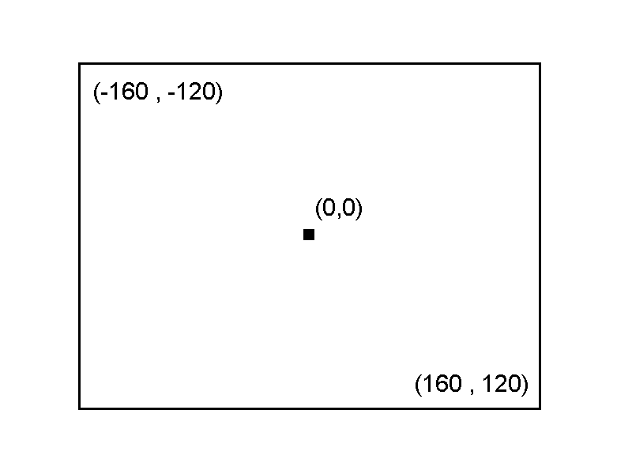

# Your First ~~triangle~~ point / line / quad / sprite (VDP1)

> [!NOTE]
> Since SRL is a SGL Wrapper , most of its concepts are interchangeable 


## 2D Coordinate system primer

> [!NOTE]
> The resolution on the sega saturn is not fixed.
> It is dependent of the Region the application is built
> For example, if built on PAL the resolution is 320x256. If on NTSC (low Res) 320x256. There is a NTSC high res that uses (704x480).

You can access the resolution information at run time via the `SRL::TV` class.

For 2D Graphics, the sega saturn uses the following coordinate system :




## Vector Primer

TODO : add a small vector primer


## SRL::Scene2D

In order to draw things in 2D space, SRL supplies the `SRL::Scene2d` class.
This class allows you to draw, via the VDP 1, into the screen.

This class allows you to easily draw lines, quads and sprites.

### A simple line

To draw a simple line, we start with a simple SRL program, as described on the previous chapter.

```cpp
#include <srl.hpp>

// Using to shorten names for Vector and HighColor
using namespace SRL::Types;
using namespace SRL::Math::Types;

// Main program entry
int main()
{
  // Initialize library
  SRL::Core::Initialize(HighColor::Colors::Black);
  SRL::Debug::Print(1,1, "Tutorial 02");
  SRL::Core::Synchronize(); 
  return 0;
}
```

But before drawing the line we must describe the start and end points, its color and its Z coordinate. The Z coordinate is used for sorting.
For this we can use the `` SRL::Scene2D::DrawLine() `` [documentation](https://srl.reye.me/classSRL_1_1Scene2D_ad028a771e97b80710000c3d46e2f4e50.html#ad028a771e97b80710000c3d46e2f4e50)

To define the start and end points we use 2D vectors, via the `` SRL::Math::Types::Vector2D`` . Since we use `using namespace SRL::Math::Types;` at the start, we can just declare the vector by `Vector2D`.

In this case, we want to draw a line from `(0,0)` to `(319, 239)` , we want it to be white, and on top of the screen.

```cpp

Vector2D start = Vector2D(0.0);
Vector2D start = Vector2D(319, 239);

auto color = HighColor::Colors::White;

```

In the end we end with this code :

```cpp
#include <srl.hpp>

// Using to shorten names for Vector and HighColor
using namespace SRL::Types;
using namespace SRL::Math::Types;

// Main program entry
int main()
{
    // Initialize library
	SRL::Core::Initialize(HighColor::Colors::Black);
    SRL::Debug::Print(1,1, "02_Tutorial");
    Vector2D start = Vector2D(0.0);
    Vector2D end = Vector2D(319, 239);
    auto color = HighColor::Colors::White;
    // Main program loop
	while(1)
	{   
        // Refresh screen
         SRL::Scene2D::DrawLine(start, end, color, 500);
         SRL::Core::Synchronize();
	}

	return 0;
}
``` 

However, the output is not whats expected :

This is because SRL sets the center of screen at (0,0).

Therefore, we must obtain the current resolution and recalculate the start and end points.

The code now is :

```cpp
#include <srl.hpp>

// Using to shorten names for Vector and HighColor
using namespace SRL::Types;
using namespace SRL::Math::Types;

// Main program entry
int main()
{
    // Initialize library
	SRL::Core::Initialize(HighColor::Colors::Black);
    //get the screen resolution
    auto h = SRL::TV::Height;
    auto w = SRL::TV::Width;
    SRL::Debug::Print(1,1, "02_Tutorial");
    SRL::Debug::Print(1,2, "Width %d Height %d",w, h);
    
    //define the coords for start and end
    auto half_h = Fxp::Convert(h) / 2;
    auto half_w = Fxp::Convert(w) / 2;
    Vector2D start = Vector2D(-(half_w), -half_h);
    Vector2D end = Vector2D(half_w, (half_h));
    //define the color of the line
    auto color = HighColor::Colors::White;
    // Main program loop
	while(1)
	{   
        // Refresh screen
         SRL::Scene2D::DrawLine(start, end, color, 500);
         SRL::Core::Synchronize();
	}

	return 0;
}

```
Now we get the expected result : 


