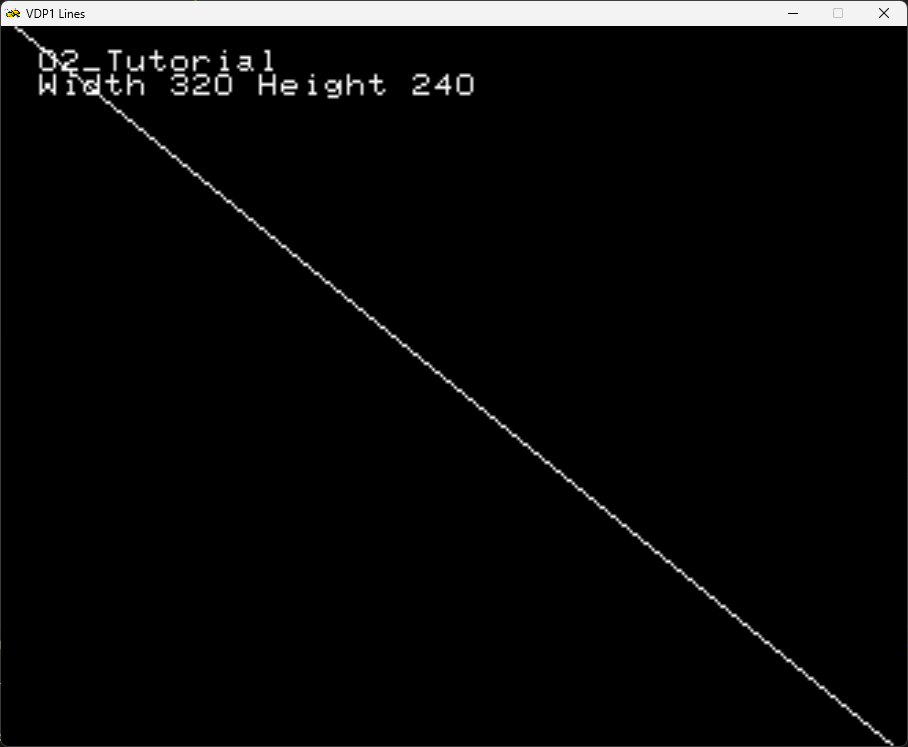
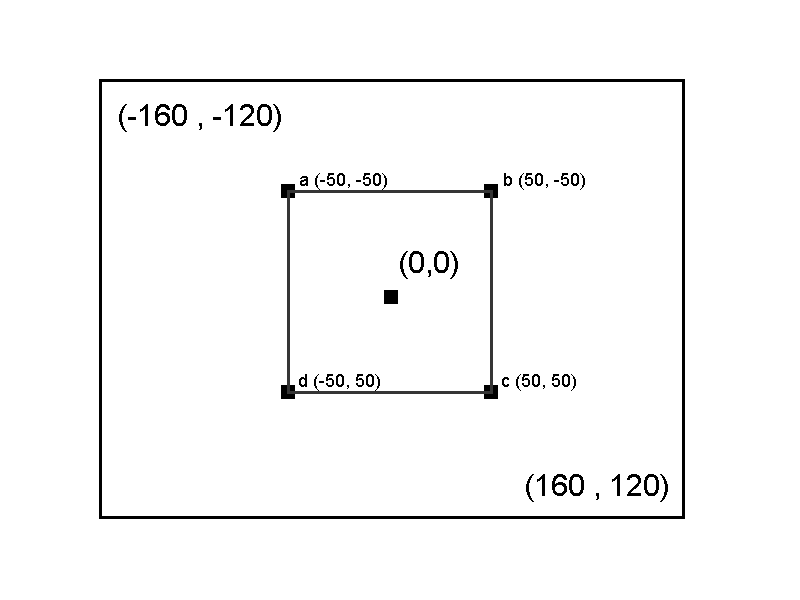
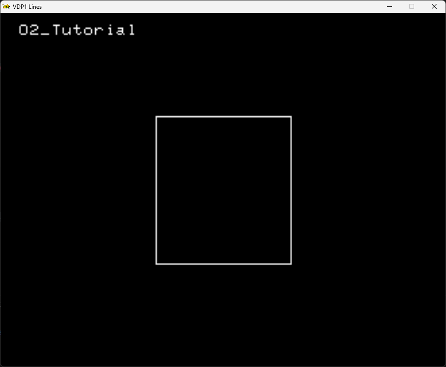

# Your First ~~triangle~~ ~~point~~ / line / quad / sprite (VDP1)

> [!NOTE]
> Since SRL is a SGL Wrapper , most of its concepts are interchangeable 

## 2D Coordinate system primer

> [!NOTE]
> The resolution on the sega saturn is not fixed.
> It is dependent of the Region the application is built
> For example, if built on PAL the resolution is 320x256. 
> If on NTSC (low Res) 320x240. There is also a NTSC high resolution mode : 704x480.

You can access the resolution information at run time via the `SRL::TV` class.

For 2D Graphics, SRL uses the following coordinate system :


## Vector Primer

SRL provides several [math types](https://srl.reye.me/namespaceSRL_1_1Math_1_1Types.html) optimized for use for the sega saturn hardware.


## SRL::Scene2D

In order to draw things in 2D space, SRL supplies the `SRL::Scene2D` class.
This class allows you to draw, via the VDP 1, to the screen.

This class allows you to easily draw lines, quads and sprites.

### A simple line

To draw a simple line, we start with a simple SRL program, as described on the previous chapter.

```cpp
#include <srl.hpp>

// Using to shorten names for Vector and HighColor
using namespace SRL::Types;
using namespace SRL::Math::Types;

// Main program entry
int main()
{
  // Initialize library
  SRL::Core::Initialize(HighColor::Colors::Black);
  SRL::Debug::Print(1,1, "Tutorial 02");
  SRL::Core::Synchronize(); 
  return 0;
}
```

But before drawing the line we must describe the start and end points, its color and its Z coordinate. The Z coordinate is used for sorting.
For this we can use the `` SRL::Scene2D::DrawLine() `` [documentation](https://srl.reye.me/classSRL_1_1Scene2D_ad028a771e97b80710000c3d46e2f4e50.html#ad028a771e97b80710000c3d46e2f4e50)

To define the start and end points we use 2D vectors, via the `` SRL::Math::Types::Vector2D`` . Since we use `using namespace SRL::Math::Types;` at the start, we can just declare the vector by `Vector2D`.

In this case, we want to draw a line from upper right corner to the bottom left corner , we want it to be white, and on top of the screen.

Taking into account the picture above describing the coordinate system, we must calculate the coordinates taking into account the current resolution.

```cpp

// Get screen resolution
auto h = SRL::TV::Height;
auto w = SRL::TV::Width;

//get the halves
auto half_h = Fxp::Convert(h) / 2;
auto half_w = Fxp::Convert(w) / 2;

// since (0,0) is at the center of the screen, 
Vector2D start = Vector2D(-(half_w), -half_h);
Vector2D end = Vector2D(half_w, (half_h));

//Color of our line
auto color = HighColor::Colors::White;

```


The code now is :

```cpp
#include <srl.hpp>

// Using to shorten names for Vector and HighColor
using namespace SRL::Types;
using namespace SRL::Math::Types;

// Main program entry
int main()
{
    // Initialize library
	SRL::Core::Initialize(HighColor::Colors::Black);
    //get the screen resolution
    auto h = SRL::TV::Height;
    auto w = SRL::TV::Width;
    SRL::Debug::Print(1,1, "02_Tutorial");
    SRL::Debug::Print(1,2, "Width %d Height %d",w, h);
    
    //define the coords for start and end
    auto half_h = Fxp::Convert(h) / 2;
    auto half_w = Fxp::Convert(w) / 2;
    Vector2D start = Vector2D(-(half_w), -half_h);
    Vector2D end = Vector2D(half_w, half_h);
    SRL::Debug::Print(1,3, "Width %f Height %f", -(half_w), -half_h );
    SRL::Debug::Print(1,4, "Width %f Height %f", half_w, half_h);
    //define the color of the line
    auto color = HighColor::Colors::White;
    // Main program loop
	while(1)
	{   
        // Refresh screen
         SRL::Scene2D::DrawLine(start, end, color, 500);
         SRL::Core::Synchronize();
	}

	return 0;
}

```
Now we get the expected result : 



### A simple quad

To draw polygons such as quads , SRL provides the [`SRL::Scene2D::DrawPolygon()`](https://srl.reye.me/classSRL_1_1Scene2D_a4fd11e4e81494caf00830893c07722bc.html#a4fd11e4e81494caf00830893c07722bc) Function.

To draw a polygon we must provide :
- A list of 4 2D Vectors, with the polygon points.
- A boolean to tell the function if the polygon should be filled or not
- the color (similar to `SRL::Scene2D::DrawLine()`)
- the z order (similar to `SRL::Scene2D::DrawLine()`)


In this example we will draw a quad according to the picture :



To draw a quad, at the center of the screen, we must define the points. Order is not relevant.

```cpp

 Vector2D points[4] = {Vector2D(0.0)};
    points[0] = Vector2D(-50, -50);
    points[1] = Vector2D(50,  -50);
    points[2] = Vector2D( 50,  50);
    points[3] = Vector2D(-50,  50);

    bool fill = false;
    auto color = HighColor::Colors::White;

```

Now the code becomes :

```cpp
#include <srl.hpp>

// Using to shorten names for Vector and HighColor
using namespace SRL::Types;
using namespace SRL::Math::Types;

// Main program entry
int main()
{
    // Initialize library
	SRL::Core::Initialize(HighColor::Colors::Black);

    SRL::Debug::Print(1,1, "02_Tutorial");
    
    Vector2D points[4] = {Vector2D(0.0)};
    points[0] = Vector2D(-50, -50);
    points[1] = Vector2D(50,  -50);
    points[2] = Vector2D( 50,  50);
    points[3] = Vector2D(-50,  50);

    bool fill = false;
    auto color = HighColor::Colors::White;

	while(1)
	{   
        // Refresh screen
        SRL::Scene2D::DrawPolygon(points, fill, color, 50);
        
        SRL::Core::Synchronize();
	}

	return 0;
}
```

Result  :



If you set the `fill` option to true, you get a filled polygon.


## Summary

In this short tutorial you learned that :
- SRL supplies the `SRL::Scene2D` class the provides the methods to draw in 2D Space
  -  `SRL::Scene2D::DrawLine()` to draw lines
  -  `SRL::Scene2D::DrawPolygon()` to draw 4 sided polygons , that can be filled or not depending on its arguments.
  


