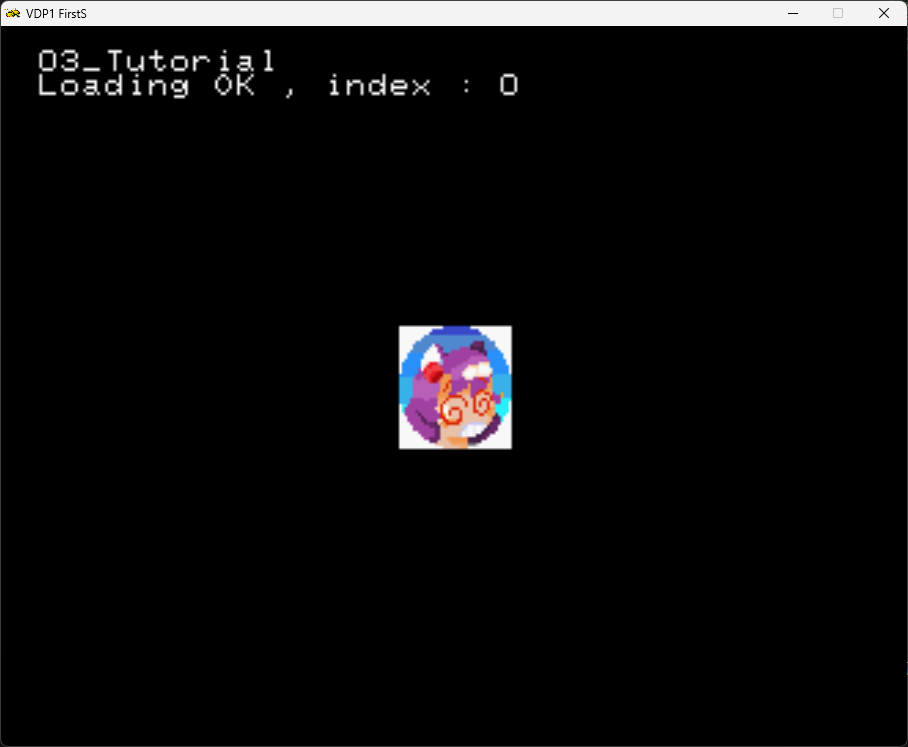
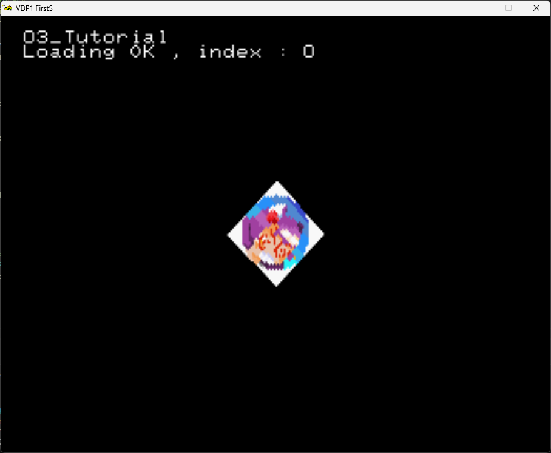
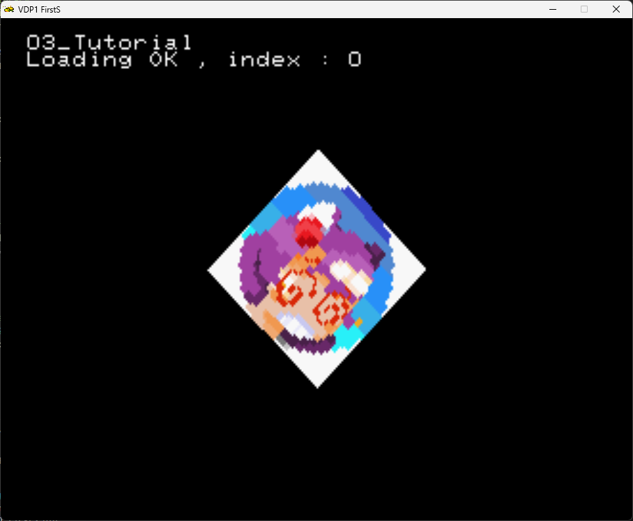
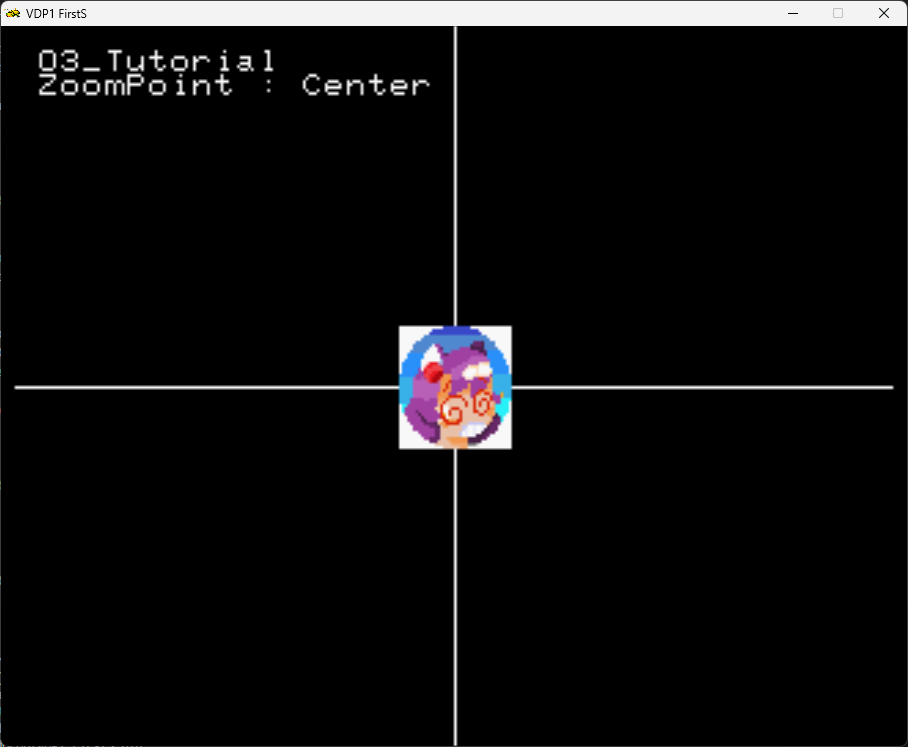

# Your First Sprite

The `SRL::Scene2D` class provides 6 different `DrawSprite` methods to draw sprites on the 2D plane.

However , before getting into the `DrawSprite` methods we must first know how to load the bitmap.
For this example, we will be loading a TGA file from the CD file system.

> [!NOTE]
> There are other ways to load bitmaps to use as sprites, but they are out of the scope of this tutorial.

## File system primer

When you compile a project in SLR, via the `compile.bat` , the files on the `cd\data` folder are written into the resulting CD image.
However the files must comply with the 8.3 format, case insensitive, like the old MS-DOS days. 
There is also a file count limit , that its set on the `makefile` at the root of the project, via the `SRL_MAX_CD_FILES` option.

## Sprite constraints

> [!WARNING]
> Be aware of the limitations of the sega saturn hardware.
> During TGA loading, some main ram is used to convert the TGA image into a format usable by VDP1 and VDP2.

Image width must be divisible by 8.


## Sprite loading

On this tutorial, the sprite loading into VDP1 ram is done in 2 steps :
- Create a `SRL::Bitmap::TGA` object to load from the CD file system into main RAM.
- Load it into VDP1 via the `SRL::VDP1::TryLoadTexture`
- Free the memory in main RAM occupied by the `SRL::Bitmap::TGA` object.
- Pass the loaded texture in into `SRL::Scene2D::DrawSprite`
- Profit.

```cpp

    SRL::Bitmap::TGA *tga = new SRL::Bitmap::TGA("TEST.TGA"); // Loads TGA file into main RAM
    int32_t textureIndex = SRL::VDP1::TryLoadTexture(tga);    // Loads TGA into VDP1
    delete tga;                                               // Frees main RAM

```

At the end, the `textureIndex` will contain the index of the texture. This value will then be passed into `SRL::Scene2D::DrawSprite`.


> [!TIP]
> It is very useful to test the return value of `SRL::VDP1::TryLoadTexture`. If its less then 0, the loading failed.


## Sprite Drawing

To actually draw the sprite into the screen SRL provides the `SRL::Scene2D::DrawSprite`.
Currently there are 6 overloads of this function.

### The simplest way

The most simple way is by using :
```cpp 
static bool SRL::Scene2D::DrawSprite	(	const uint16_t	texture,
        const SRL::Math::Types::Vector3D &	location,
        const SRL::Math::Types::Angle &	angle = SRL::Math::Types::Angle::Zero(),
        const SRL::Math::Types::Vector2D &	scale = SRL::Math::Types::Vector2D(1.0, 1.0),
        const Scene2D::ZoomPoint	zoomPoint = Scene2D::ZoomPoint::Center )

```

> [!TIP]
> Don't be intimidated by the function argument list! Since the last 3 arguments are optional, we can start using this function by providing only 2 arguments :

- `texture` is the textureIndex returned by `SRL::VDP1::TryLoadTexture` , 
- `location` is a Vector3D with X and Y locations and  for Z sorting.

And then we pass the textureIndex and location vector into `SRL::Scene2D::DrawSprite` :

```cpp
SRL::Scene2D::DrawSprite(textureIndex, Vector3D(0.0, 0.0, 500));
```

So the resulting code is :

```cpp
#include <srl.hpp>

// Using to shorten names for Vector and HighColor
using namespace SRL::Types;
using namespace SRL::Math::Types;

int main()
{
   	SRL::Core::Initialize(HighColor::Colors::Black); // Initialize library
    SRL::Debug::Print(1,1, "03_Tutorial");
           
    SRL::Bitmap::TGA *tga = new SRL::Bitmap::TGA("TEST.TGA"); // Loads TGA file from cd into main RAM
    int32_t textureIndex = SRL::VDP1::TryLoadTexture(tga);    // Loads Bitmap from main RAM into VDP1 RAM
    
    if(textureIndex < 0) // Check if texture was properly loaded into VDP1 RAM
    {
         SRL::Debug::Print(1,2, "Loading Failed");
    }else
    {
        SRL::Debug::Print(1,2, "Loading OK , index : %d", textureIndex);
    }  
    
    delete tga;  // Free memory used by Bitmap in main RAM

	while(1) // Main program loop
	{   
        SRL::Scene2D::DrawSprite(textureIndex, Vector3D(0.0, 0.0, 500));
        SRL::Core::Synchronize(); // Refresh screen
	}

	return 0;
}

```

And the resulting image :



If you take a further look at the function signature you can also specify rotation, scale and a zoom point.

However you might have noticed that there is an specific type for angles.

## `SRL::Math::Types::Angle` Introduction

The `SRL::Math::Types::Angle` is the type used in SRL for angles. 

3 Different constructors are supplied :
- `constexpr Angle ()` that simply constructs a `SRL::Math::Types::Angle` with 0 Degrees.
- `constexpr Angle (const Fxp &turns)` that takes the number of **turns** in `Fxp`.
- `constexpr Angle (const T &turns)` that takes the number of turns in a numeric format such as `float` or `int` values.


> [!WARNING]
> Be aware that the constructor takes **turns** , not degrees or radians!

## Rotating the Sprite

If you want to turn the sprite by 45º first we declare a `Angle` variable :

```cpp
Angle SpriteAngle = Angle(0.125); // since 45º is 1/8 of a turn = 0.125
```
And then supply the `SpriteAngle` to  `SRL::Scene2D::DrawSprite`

```cpp
SRL::Scene2D::DrawSprite(textureIndex, Vector3D(0.0, 0.0, 500), SpriteAngle);
```

The result is :




However, there will be situations where is more convenient to work with degrees or radiants.

### Working with Radians and degrees

`SRL::Math::Types::Angle` provides methods that allows for conversion from degrees and radiants to `Angle` in runtime :

- `static constexpr Angle FromRadians (const Fxp &radianTurns)` - Converts from Radiants stored in a `Fxp` type to `Angle`
- `static constexpr Angle FromDegrees (const Fxp &degreeTurns)` - Converts from Degrees stored in a `Fxp` type to `Angle`

> [!TIP]
> There are also functions that convert from radiants and degrees stored in the `double` type at compile time, but we wont cover those here.

So if we want to use degrees instead of turns we can instead write :

```cpp
Angle SpriteAngle = Angle::FromDegrees(45.0);
```
That will have the same result.

## Scaling the Sprites

To scale a sprite, we first define a `Vector2D` that will contain the X scaling on the first component and the Y scaling on the second component.

If the scale value is > 1.0 the sprite sill be made bigger on that axis. If < 1.0 then the sprite will be made smaller on the axis.

For example :

```cpp
Vector2D scale = Vector2D(1.5, 1.5);
```
Then we pass it to `SRL::Scene2D::DrawSprite` :

```cpp
SRL::Scene2D::DrawSprite(textureIndex, Vector3D(0.0, 0.0, 500), SpriteAngle, scale);
```

The resulting rotated and scaled sprite can be seen below.



## The ZoomPoint

The [ZoomPoint](https://srl.reye.me/classSRL_1_1Scene2D_a2f09ba617c34e0ae409e8717482799c8.html#a2f09ba617c34e0ae409e8717482799c8) sets the Origin on the sprite.
This is an enum that can take the following choices :
- `UpperLeft` Upper left corner.
- `CenterLeft` Center left side.
- `BottomLeft` Bottom left corner.
- `TopCenter` Center top side.
- `Center` Sprite center.
- `BottomCenter` Center bottom side.
- `UpperRight` Upper right corner.
- `CenterRight` Center right side.
- `BottomRight` Bottom right corner.

To make it more simple, lets draw our sprite at `0,0`, and try different values for the zoom point.

To set a zoom point  :

```cpp
SRL::Scene2D::ZoomPoint zp = SRL::Scene2D::ZoomPoint::Center;
```

And then we can pass it to the `SRL::Scene2D::DrawSprite` :

```cpp
SRL::Scene2D::DrawSprite(textureIndex, Vector3D(0.0, 0.0, 500), Angle(), scale, zp);
```

And for clarity, I've added 2 lines , crossing at `(0,0)` for reference.

Result :


