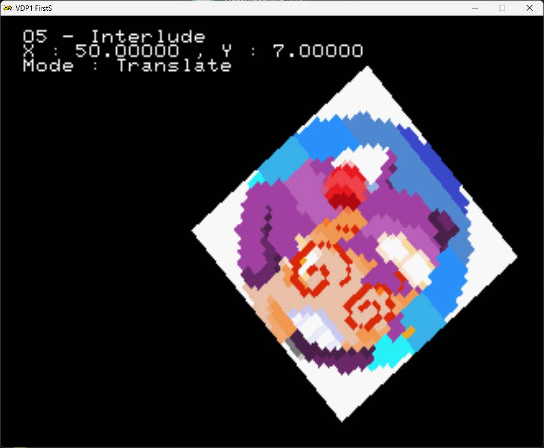

# Interlude : Putting everything (so far) together

The goal of this chapter is making a simple program that uses all the concepts discussed in chapters 01 - 04 :
- Load Sprites from the CD
- Use the gamepad 1 for input - to move the sprite around
- Keep the code *manageable*

For starters , lets get back to the initial baseline :

```cpp
#include <srl.hpp>

// Using to shorten names for Vector , HighColor and Input
using namespace SRL::Types;
using namespace SRL::Math::Types;
using namespace SRL::Input;

// Main program entry
int main()
{
  // Initialize library
  SRL::Core::Initialize(HighColor::Colors::Black);
  SRL::Debug::Print(1,1, "05 - Interlude");
  while(1)
  {
    SRL::Core::Synchronize(); 
  }
  return 0;
}
```

If you recall the sprite loading code, from chapter 03 , it is something like this :

```cpp
SRL::Bitmap::TGA *tga = new SRL::Bitmap::TGA("TEST.TGA"); // Loads TGA file from cd into main RAM
int32_t textureIndex = SRL::VDP1::TryLoadTexture(tga);    // Loads Bitmap from main RAM into VDP1 RAM
if(textureIndex < 0) // Check if texture was properly loaded into VDP1 RAM
    {
         SRL::Debug::Print(1,2, "Loading Failed");
    }else
    {
        SRL::Debug::Print(1,2, "Loading OK , index : %d", textureIndex);
    }  
    delete tga;  // Free memory used by Bitmap in main RAM
```

## Modularize code

But if you use an arbitrary number of sprites, copy pasting code for each sprite we wish to load is **not** the way to go, specially if you value your sanity.
And since the only thing we care about, in our example, is to have the Sprite loaded into VDP1 ram and have its ID, we will wrap the sprite loading code into a function.

```cpp
int32_t loadTGA(char* filename)
    {
        SRL::Bitmap::TGA *tga = new SRL::Bitmap::TGA(filename); // Loads TGA file into main RAM
        int32_t textureIndex = SRL::VDP1::TryLoadTexture(tga);  // Loads TGA into VDP1
        delete tga;  
        return textureIndex;
    }
```

Now we have a simple function that I can call whenever I wish to load a sprite into VDP1. We can add a check to ensure the texture was properly loaded later.

So the code to draw a sprite, in the center of the screen becomes :

```cpp
#include <srl.hpp>

// Using to shorten names for Vector , HighColor and Input
using namespace SRL::Types;
using namespace SRL::Math::Types;
using namespace SRL::Input;

int32_t loadTGA(char* filename) //texture loading function
{
    SRL::Bitmap::TGA *tga = new SRL::Bitmap::TGA(filename); // Loads TGA file into main RAM
    int32_t textureIndex = SRL::VDP1::TryLoadTexture(tga);  // Loads TGA into VDP1
    delete tga;  
    return textureIndex;
}

int main() // Main program entry
{
  // Initialize library
  SRL::Core::Initialize(HighColor::Colors::Black);
  SRL::Debug::Print(1,1, "05 - Interlude");

  int32_t SpriteId = 0;
  SpriteId = loadTGA("TEST.TGA");

  while(1)
  {
    SRL::Scene2D::DrawSprite(SpriteId, Vector3D(0.0, 0.0, 500));
    SRL::Core::Synchronize(); 
  }
  return 0;
}
```

## Moving the sprite

To move the sprite around the screen we must be able to change is position at run time.
To do this, we can either declare 2 `Fxp` variables, or a single `Vector2D` variable, to contain the sprite coordinates.

> [!TIP]
> Remember that the `SRL::Scene2D::DrawSprite` takes a `Vector2D` or `Vector3D` depending on the used constructor.

In this case we will use a single `Vector2D` variable :

```cpp
Vector2D spritePos = Vector2D(0.0);
```
And we Initialize the digital peripheral :

```cpp
Digital port(0);
```

Now we want , for now , to change the position of the sprite every time the Dpad is pressed.
If you recall chapter 4 , it is done via `isHeld` method.
Adding the code we now get :

```cpp
  if(port.IsConnected())
      {
        SRL::Debug::Print(1,2, "Connected");

        if(port.IsHeld(Digital::Button::Up))
        {
            spritePos.Y = spritePos.Y - 1 ;
        }
        if(port.IsHeld(Digital::Button::Down))
        {
            spritePos.Y = spritePos.Y + 1 ;
        }
        if(port.IsHeld(Digital::Button::Left))
        {
            spritePos.X = spritePos.X - 1 ;
        }
        if(port.IsHeld(Digital::Button::Right))
        {
            spritePos.X = spritePos.X + 1 ;
        }

      }else
      {
         SRL::Debug::Print(1,2, "Not connected");
      }

```

> [!TIP]
> You can access the [`Vector2D`](https://srl.reye.me/structSRL_1_1Math_1_1Types_1_1Vector2D.html) and [`Vector3D`](https://srl.reye.me/structSRL_1_1Math_1_1Types_1_1Vector3D.html) componentes via the `X` , `Y` and `Z` in case of `Vector3D`.

The final code looks like this :

```cpp
#include <srl.hpp>

// Using to shorten names for Vector , HighColor and Input
using namespace SRL::Types;
using namespace SRL::Math::Types;
using namespace SRL::Input;

int32_t loadTGA(char* filename) //texture loading function
    {
        SRL::Bitmap::TGA *tga = new SRL::Bitmap::TGA(filename); // Loads TGA file into main RAM
        int32_t textureIndex = SRL::VDP1::TryLoadTexture(tga);  // Loads TGA into VDP1
        delete tga;  
        return textureIndex;
    }


int main() // Main program entry
{
  // Initialize library
  SRL::Core::Initialize(HighColor::Colors::Black);
  SRL::Debug::Print(1,1, "05 - Interlude");

  int32_t SpriteId = 0;
  SpriteId = loadTGA("TEST.TGA");

  Vector2D spritePos = Vector2D(0.0);
  Digital port(0);

  while(1)
  {
    SRL::Debug::PrintClearLine(2);
    
    if(port.IsConnected())
      {
        SRL::Debug::Print(1,2, "Connected");

        if(port.IsHeld(Digital::Button::Up))
        {
            spritePos.Y = spritePos.Y - 1 ;
        }
        if(port.IsHeld(Digital::Button::Down))
        {
            spritePos.Y = spritePos.Y + 1 ;
        }
        if(port.IsHeld(Digital::Button::Left))
        {
            spritePos.X = spritePos.X - 1 ;
        }
        if(port.IsHeld(Digital::Button::Right))
        {
            spritePos.X = spritePos.X + 1 ;
        }

      }else
      {
         SRL::Debug::Print(1,2, "Not connected");
      }
    SRL::Debug::Print(1,2, "X : %f , Y : %f", spritePos.X, spritePos.Y);
    SRL::Scene2D::DrawSprite(SpriteId, Vector3D(spritePos, 500));
    SRL::Core::Synchronize(); 
  }
  return 0;
}
```

However, the render loop is getting longer and long blocks of code are harder to read and debug. This will get worse when we add the handling of more buttons.

In order to keep the render loop manageable, we can put the input handling inside a function. This way we can keep the render loop code as clean and short as possible.


```cpp
bool updatePosition(Digital &port, Vector2D &spritePos)
{
    if(port.IsConnected() == false)
    {
        return false;
    }

    if(port.IsHeld(Digital::Button::Up))
    {
        spritePos.Y = spritePos.Y - 1 ;
    }
    if(port.IsHeld(Digital::Button::Down))
    {
        spritePos.Y = spritePos.Y + 1 ;
    }
    if(port.IsHeld(Digital::Button::Left))
    {
        spritePos.X = spritePos.X - 1 ;
    }
    if(port.IsHeld(Digital::Button::Right))
    {
        spritePos.X = spritePos.X + 1 ;
    }

    return true;
}
```

> [!NOTE] 
> Passing by value vs Passing by reference :
> 
> You probably noticed that the function to update the position vector does not return a vector, and it takes *references* to the Digital port class and the position vector.
> This is intentional : if we pass by value, we are passing a copy of the variable to the function, by passing by reference we read / modify directly the variable through the reference. We thus avoid using more memory and save some time since we don´t have do copy data around.

Now the code becomes : 

```cpp
#include <srl.hpp>

// Using to shorten names for Vector , HighColor and Input
using namespace SRL::Types;
using namespace SRL::Math::Types;
using namespace SRL::Input;

int32_t loadTGA(char* filename) //texture loading function
    {
        SRL::Bitmap::TGA *tga = new SRL::Bitmap::TGA(filename); // Loads TGA file into main RAM
        int32_t textureIndex = SRL::VDP1::TryLoadTexture(tga);  // Loads TGA into VDP1
        delete tga;  
        return textureIndex;
    }

bool updatePosition(Digital &port, Vector2D &spritePos)
{
    if(port.IsConnected() == false)
    {
        return false;
    }

    if(port.IsHeld(Digital::Button::Up))
    {
        spritePos.Y = spritePos.Y - 1 ;
    }
    if(port.IsHeld(Digital::Button::Down))
    {
        spritePos.Y = spritePos.Y + 1 ;
    }
    if(port.IsHeld(Digital::Button::Left))
    {
        spritePos.X = spritePos.X - 1 ;
    }
    if(port.IsHeld(Digital::Button::Right))
    {
        spritePos.X = spritePos.X + 1 ;
    }

    return true;
}


int main() // Main program entry
{
  // Initialize library
  SRL::Core::Initialize(HighColor::Colors::Black);
  SRL::Debug::Print(1,1, "05 - Interlude");

  int32_t SpriteId = 0;
  SpriteId = loadTGA("TEST.TGA");
  Vector2D spritePos = Vector2D(0.0);
  Digital port(0);

  while(1) // render loop
  {
    SRL::Debug::PrintClearLine(2);
    updatePosition(port, spritePos);
    SRL::Debug::Print(1,2, "X : %f , Y : %f", spritePos.X, spritePos.Y);
    SRL::Scene2D::DrawSprite(SpriteId, Vector3D(spritePos, 500));
    SRL::Core::Synchronize(); 
  }
  return 0;
}


```

Now the render loop looks cleaner, and the input handling functionality was split into a separate function. Increasing the complexity of the input handling functionality won´t impact the readability of the render loop.


## Adding states

Now we want to change the rotation and scaling of out sprite.
We could map a given button for every parameter we wish to change, but that does not seem very practical.
We will instead have a button to select what will be changed (scale, position, rotation) and use the Dpad to change it.

First let's create a [enumeration](https://en.cppreference.com/w/cpp/language/enum.html) with our manipulation state:

```cpp
enum manipulationMode {translate = 0, scaleUniform ,  scaleX, scaleY , rotate};
```

We will use the `A` button to switch states.

So we would start by changing our previous `updatePosition` function to take then enum of the `manupulationMode` :

```cpp
bool updatePosition(Digital &port, Vector2D &spritePos, manipulationMode &mode)
{
    if(port.IsConnected() == false)
    {
        return false;
    }

    if(port.IsHeld(Digital::Button::A))
    {
        switch(mode)
        {
            case translate : mode = scaleUniform;
            break;
            case scaleUniform : mode = scaleX;
            break;
            case scaleX : mode = scaleY ;
            break;
            case scaleY : mode = rotate ;
            break;
            case rotate : mode = translate ;
            break;
            default : mode = translate;
            break;
        }
    }

    switch(mode)
    {
        case translate : SRL::Debug::Print(1,3,"Mode : Translate");
        break;
        case scaleUniform : SRL::Debug::Print(1,3,"Mode : scaleUniform");
        break;
        case scaleX : SRL::Debug::Print(1,3,"Mode : scaleX");
        break;
        case scaleY : SRL::Debug::Print(1,3,"Mode : scaleY");
        break;
        case rotate : SRL::Debug::Print(1,3,"Mode : rotate");
        break;
        default :  SRL::Debug::Print(1,3,"Mode : unknown");
    }

    if(port.IsHeld(Digital::Button::Up))
    {
        spritePos.Y = spritePos.Y - 1 ;
    }
    if(port.IsHeld(Digital::Button::Down))
    {
        spritePos.Y = spritePos.Y + 1 ;
    }
    if(port.IsHeld(Digital::Button::Left))
    {
        spritePos.X = spritePos.X - 1 ;
    }
    if(port.IsHeld(Digital::Button::Right))
    {
        spritePos.X = spritePos.X + 1 ;
    }

    return true;
}
```

Now the full code becomes :

```cpp
#include <srl.hpp>

// Using to shorten names for Vector , HighColor and Input
using namespace SRL::Types;
using namespace SRL::Math::Types;
using namespace SRL::Input;


int32_t loadTGA(char* filename) //texture loading function
    {
        SRL::Bitmap::TGA *tga = new SRL::Bitmap::TGA(filename); // Loads TGA file into main RAM
        int32_t textureIndex = SRL::VDP1::TryLoadTexture(tga);  // Loads TGA into VDP1
        delete tga;  
        return textureIndex;
    }

enum manipulationMode {translate = 0, scaleUniform ,  scaleX, scaleY , rotate};

bool updatePosition(Digital &port, Vector2D &spritePos, manipulationMode &mode)
{
    if(port.IsConnected() == false)
    {
        return false;
    }

    if(port.IsHeld(Digital::Button::A))
    {
        switch(mode)
        {
            case translate : mode = scaleUniform;
            break;
            case scaleUniform : mode = scaleX;
            break;
            case scaleX : mode = scaleY ;
            break;
            case scaleY : mode = rotate ;
            break;
            case rotate : mode = translate ;
            break;
            default : mode = translate;
            break;
        }
    }

    switch(mode)
    {
        case translate : SRL::Debug::Print(1,3,"Mode : Translate");
        break;
        case scaleUniform : SRL::Debug::Print(1,3,"Mode : scaleUniform");
        break;
        case scaleX : SRL::Debug::Print(1,3,"Mode : scaleX");
        break;
        case scaleY : SRL::Debug::Print(1,3,"Mode : scaleY");
        break;
        case rotate : SRL::Debug::Print(1,3,"Mode : rotate");
        break;
        default :  SRL::Debug::Print(1,3,"Mode : unknown");
    }
    
    if(port.IsHeld(Digital::Button::Up))
    {
        spritePos.Y = spritePos.Y - 1 ;
    }
    if(port.IsHeld(Digital::Button::Down))
    {
        spritePos.Y = spritePos.Y + 1 ;
    }
    if(port.IsHeld(Digital::Button::Left))
    {
        spritePos.X = spritePos.X - 1 ;
    }
    if(port.IsHeld(Digital::Button::Right))
    {
        spritePos.X = spritePos.X + 1 ;
    }

    return true;
}

int main() // Main program entry
{
  // Initialize library
  SRL::Core::Initialize(HighColor::Colors::Black);
  SRL::Debug::Print(1,1, "05 - Interlude");

  int32_t SpriteId = 0;
  SpriteId = loadTGA("TEST.TGA");
  manipulationMode state = translate;
  Vector2D spritePos = Vector2D(0.0);
  Digital port(0);

  while(1)
  {
    SRL::Debug::PrintClearLine(2);
    SRL::Debug::PrintClearLine(3);
    updatePosition(port, spritePos, state);
    SRL::Debug::Print(1,2, "X : %f , Y : %f", spritePos.X, spritePos.Y);
    SRL::Scene2D::DrawSprite(SpriteId, Vector3D(spritePos, 500));
    SRL::Core::Synchronize(); 
  }
  return 0;
}
```

When testing the code, an unintended behavior emerges : If you keep the button `A` pressed, the program will loop between different `manipulationMode` states.
This is unintended, since we want to change the state ONCE per press.

We can do this by changing the code `port.IsHeld(Digital::Button::A)` to `port.WasPressed(Digital::Button::A)`.

And now the state switching works as expected. 
Now we can add the scale vector and rotation to the code :

```cpp
Vector2D spriteScale = Vector2D(1.0);
Fxp Angle = 0.0;
```

And we change the signature of our `spritePosition` to take the reference of our scale vector and Angle value.
We will also add handling for scaling, rotation and angle. 

```cpp
#include <srl.hpp>

// Using to shorten names for Vector , HighColor and Input
using namespace SRL::Types;
using namespace SRL::Math::Types;
using namespace SRL::Input;

int32_t loadTGA(char* filename) //texture loading function
    {
        SRL::Bitmap::TGA *tga = new SRL::Bitmap::TGA(filename); // Loads TGA file into main RAM
        int32_t textureIndex = SRL::VDP1::TryLoadTexture(tga);  // Loads TGA into VDP1
        delete tga;  
        return textureIndex;
    }

enum manipulationMode {translate = 0, scaleUniform ,  scaleX, scaleY , rotate};

bool updatePosition(Digital &port, Vector2D &spritePos,  Vector2D &spriteScale, Fxp &angle, manipulationMode &mode)
{
    if(port.IsConnected() == false)
    {
        return false;
    }

    if(port.WasPressed(Digital::Button::A))
    {
        switch(mode)
        {
            case translate : mode = scaleUniform;
            break;
            case scaleUniform : mode = scaleX;
            break;
            case scaleX : mode = scaleY ;
            break;
            case scaleY : mode = rotate ;
            break;
            case rotate : mode = translate ;
            break;
            default : mode = translate;
            break;
        }
    }

    if(port.WasPressed(Digital::Button::C)) // Reset the location, scale, rotation.
    {
        spritePos = Vector2D(0.0);
        spriteScale = Vector2D(1.0);
        angle = 0.0;
    }

    switch(mode)
    {
        case translate : SRL::Debug::Print(1,3,"Mode : Translate");
        break;
        case scaleUniform : SRL::Debug::Print(1,3,"Mode : scaleUniform");
        break;
        case scaleX : SRL::Debug::Print(1,3,"Mode : scaleX");
        break;
        case scaleY : SRL::Debug::Print(1,3,"Mode : scaleY");
        break;
        case rotate : SRL::Debug::Print(1,3,"Mode : rotate");
        break;
        default :  SRL::Debug::Print(1,3,"Mode : unknown");
    }

    if(mode == translate)
    {
        if(port.IsHeld(Digital::Button::Up))
        {
            spritePos.Y = spritePos.Y - 1 ;
        }
        if(port.IsHeld(Digital::Button::Down))
        {
            spritePos.Y = spritePos.Y + 1 ;
        }
        if(port.IsHeld(Digital::Button::Left))
        {
            spritePos.X = spritePos.X - 1 ;
        }
        if(port.IsHeld(Digital::Button::Right))
        {
            spritePos.X = spritePos.X + 1 ;
        }
    }

    if(mode == scaleUniform)
    {
        if(port.IsHeld(Digital::Button::Up) || port.IsHeld(Digital::Button::Right) )
        {
            spriteScale.X = spriteScale.X + 0.25 ;
            spriteScale.Y = spriteScale.Y + 0.25 ;
        }
        if(port.IsHeld(Digital::Button::Down) || port.IsHeld(Digital::Button::Left) )
        {
            spriteScale.X = spriteScale.X - 0.25 ;
            spriteScale.Y = spriteScale.Y - 0.25 ;
        }
    }

    if(mode == scaleX)
    {
        if(port.IsHeld(Digital::Button::Up) || port.IsHeld(Digital::Button::Right))
        {
            spriteScale.X = spriteScale.X + 0.25 ;
        }
        if(port.IsHeld(Digital::Button::Down) || port.IsHeld(Digital::Button::Left))
        {
            spriteScale.X = spriteScale.X - 0.25 ;
        }
    }

    if(mode == scaleY)
    {
        if(port.IsHeld(Digital::Button::Up) || port.IsHeld(Digital::Button::Right))
        {
            spriteScale.Y = spriteScale.Y + 0.25 ;
        }
        if(port.IsHeld(Digital::Button::Down) || port.IsHeld(Digital::Button::Left))
        {
            spriteScale.Y = spriteScale.Y - 0.25 ;
        }
    }

    if(mode == rotate)
    {
      if(port.IsHeld(Digital::Button::Up) || port.IsHeld(Digital::Button::Right))
      {
         angle += 0.25 ;
      }
      if(port.IsHeld(Digital::Button::Down) || port.IsHeld(Digital::Button::Left))
      {
         angle -= 0.25 ;
      }
    }
    return true;
}

int main() // Main program entry
{
  // Initialize library
  SRL::Core::Initialize(HighColor::Colors::Black);
  SRL::Debug::Print(1,1, "05 - Interlude");

  int32_t SpriteId = 0;
  SpriteId = loadTGA("TEST.TGA");
  manipulationMode state = translate;
  Vector2D spritePos = Vector2D(0.0);
  Vector2D spriteScale = Vector2D(1.0);
  Fxp angle = 0.0;
  Digital port(0);

  while(1)
  {
    SRL::Debug::PrintClearLine(2);
    SRL::Debug::PrintClearLine(3);
    updatePosition(port, spritePos, spriteScale, angle , state);
    SRL::Debug::Print(1,2, "X : %f , Y : %f", spritePos.X, spritePos.Y);
    SRL::Scene2D::DrawSprite(SpriteId, Vector3D(spritePos, 500), Angle::FromDegrees(angle), spriteScale);
    SRL::Core::Synchronize(); 
  }
  return 0;
}
```

The result :




# Summary

- It is recommended to avoid having large blocks of code, since those are more difficult to maintain and debug.
  - This can be done by means of implementing the functionality into functions you can re-use trough out your code (for example texture loading)
  - Specific functionality can be implemented in a function you can invoke from the render loop (for example the Input handling function).
- Pass values by reference when possible. The sega saturn is not known for having much computational resources.


