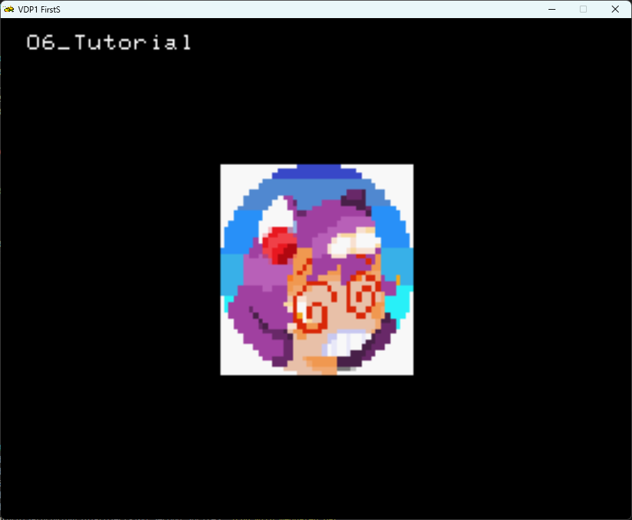
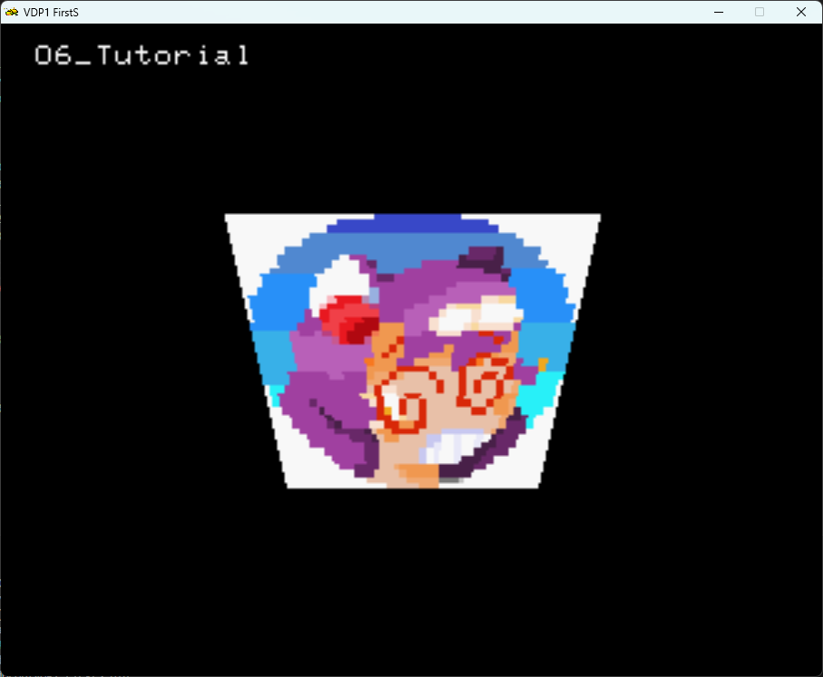
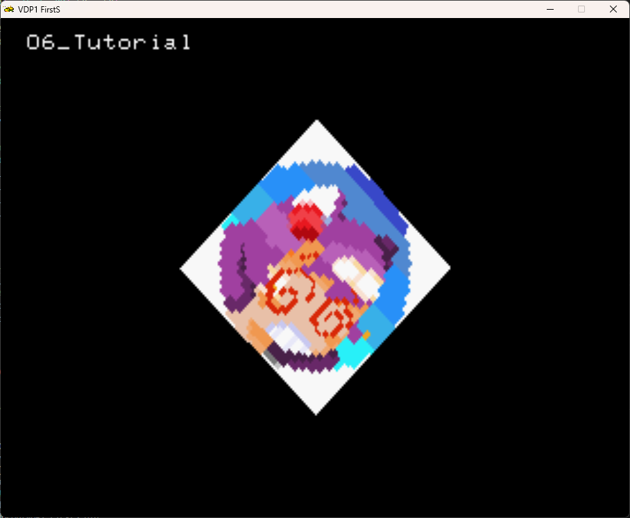
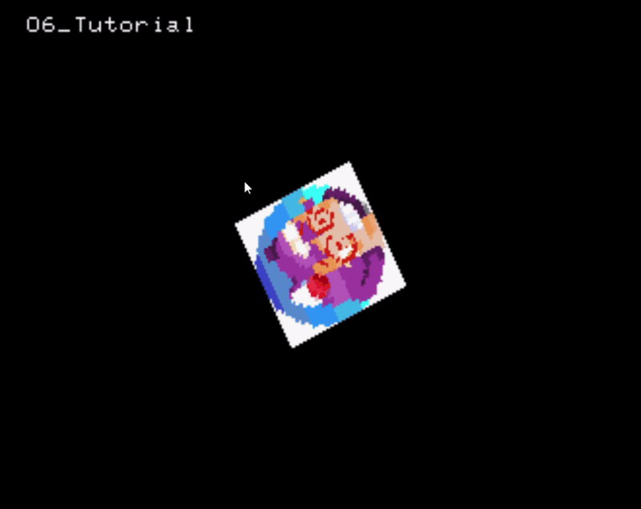
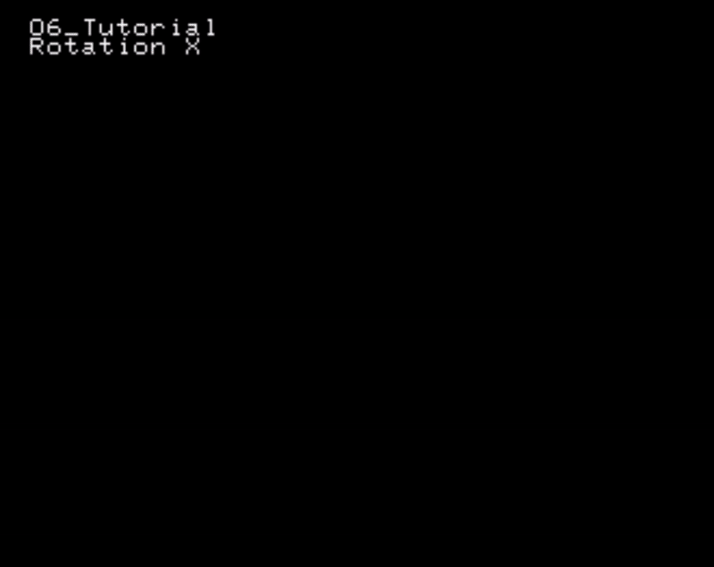
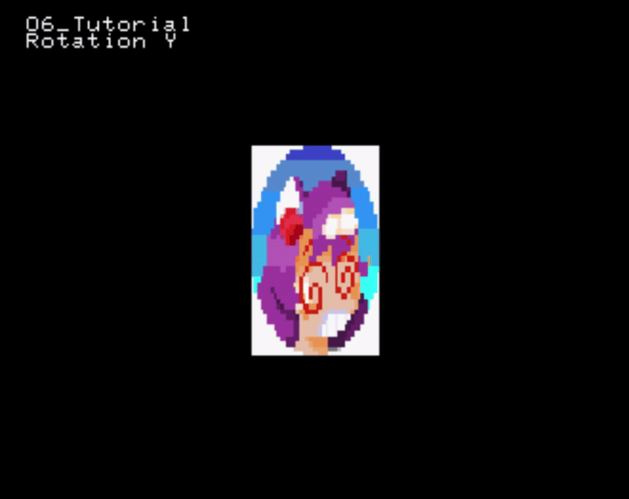
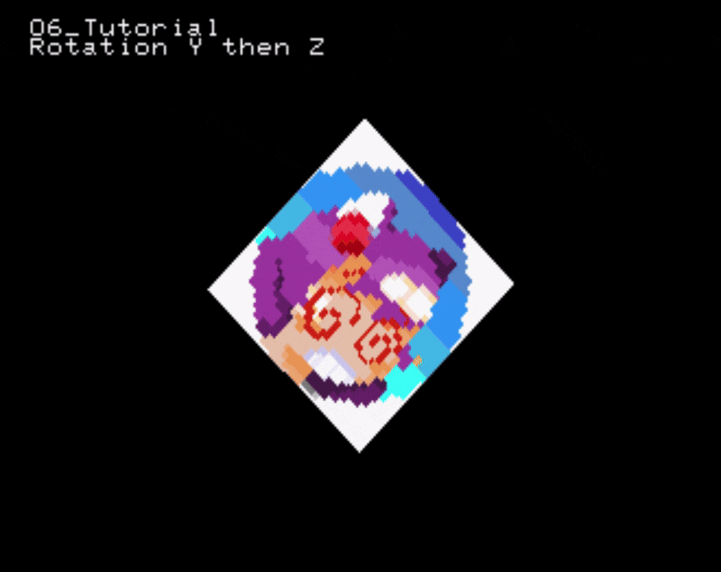

# Your Second Sprite

On [Chapter 3](../03_first_sprite/03_sprites.md) we covered the simplest way to display, rotate and resize sprites.

However there might be situations where more control on the sprites is needed : for example to apply custom transforms to the sprite's vertices.

## Sprite Drawing - Redux

On [Chapter 3](../03_first_sprite/03_sprites.md) we've drawn sprites only by specifing the `bitmap ID`, sprite `position`, and optionally `scale`, `rotation` and `zoompoint`.

Although the functions themselves are quite simple to use they do not alow for us to deform the sprite.

For this there are 2 overloads that allow for us to specify the vertices of the quad where the sprite will be mapped to.
This vertices can be transformed as we wish.

```cpp
static bool SRL::Scene2D::DrawSprite ( const uint16_t texture,
    const SRL::Math::Types::Vector2D points[4],
    const SRL::Math::Types::Fxp depth )

```

and

```cpp
static bool SRL::Scene2D::DrawSprite ( const uint16_t texture,
    SRL::CRAM::Palette * texturePalette,
    const SRL::Math::Types::Vector2D points[4],
    const SRL::Math::Types::Fxp depth )
```

> [!NOTE]
> Notice that these functions do not have rotation, scale or ZoomPoint. This is because, with these functions, you are expected to transform the sprite's edge coordinates yourself.

The use of `SRL::CRAM::Palette` will be covered at a late tutorial.

## A Distorted sprite

To start lets specify a simple quad. This Quad is where our sprite will be mapped into. Bear in mind that there are no UV coordiates : the whole sprite is fully mapped into the quad.

```cpp

 Vector2D points[4] = {Vector2D(0.0)};
    points[0] = Vector2D(-50, -50);
    points[1] = Vector2D(50,  -50);
    points[2] = Vector2D( 50,  50);
    points[3] = Vector2D(-50,  50);

```

and use our loader function as specified on [chapter 5](05_interlude/05_interlude.md):

```cpp
int32_t loadTGA(char* filename)
    {
        SRL::Bitmap::TGA *tga = new SRL::Bitmap::TGA(filename); // Loads TGA file into main RAM
        int32_t textureIndex = SRL::VDP1::TryLoadTexture(tga);  // Loads TGA into VDP1
        delete tga;  
        return textureIndex;
    }
```

Now the finished source code looks like this :

```cpp
#include <srl.hpp>

// Using to shorten names for Vector and HighColor
using namespace SRL::Types;
using namespace SRL::Math::Types;

int32_t loadTGA(char* filename) //texture loading function
    {
        SRL::Bitmap::TGA *tga = new SRL::Bitmap::TGA(filename); // Loads TGA file into main RAM
        int32_t textureIndex = SRL::VDP1::TryLoadTexture(tga);  // Loads TGA into VDP1
        delete tga;  
        return textureIndex;
    }


int main()
{
    // Initialize library
	SRL::Core::Initialize(HighColor::Colors::Black);
    SRL::Debug::Print(1,1, "06_Tutorial");

    int32_t textureIndex = loadTGA("TEST.TGA");    // Loads TGA into VDP1

    Vector2D points[4] = {Vector2D(0.0)};
    points[0] = Vector2D(-50, -50);
    points[1] = Vector2D(50,  -50);
    points[2] = Vector2D( 50,  50);
    points[3] = Vector2D(-50,  50);   
        
    // Main program loop
	while(1)
	{   
        SRL::Scene2D::DrawSprite(textureIndex,  points, 50.0 );
        // Refresh screen
        SRL::Core::Synchronize();
	}

	return 0;
}
```

The Result :



From this, we can now start to experiment with the coordiates.
Lets, for example, make the quad larger at the top :

```cpp
    points[0] = Vector2D(-75, -50);
    points[1] = Vector2D(75,  -50);
    points[2] = Vector2D( 50,  50);
    points[3] = Vector2D(-50,  50);   
```

The resulting quad :



## Manual Transforms

We can scale , rotate and transform the points of our quad.
For this, SRL provides matrices to help.

### Rotation

Since we are on the XY plane, we must rotate along the Z axis.

Therefore, using SRL we can first declare our matrix.
We can use the `RotateZ` method to apply a rotation matrix on the Z axis by the supplied angle.
We if we want the rotation matrix, we can use the  `CreateRotationZ` method , also providing the angle we want to rotate by.
SRL also provides functions to create rotation in X and Y as well.

In SRL is really simple :

You can write

```cpp
    //Declare and initialize our 3x3 matrix
    Matrix33 transform = Matrix33::Identity();
    //Lets apply a rotation matrix to our Identity Matrix
    transform.RotateZ(SRL::Math::Angle::FromDegrees(45.0));
```

An equivalent way would be to write :

```cpp
    //Declare and initialize our 3x3 matrix
    Matrix33 transform = Matrix33::Identity();
    //Lets create a rotation matrix
    transform = transform.CreateRotationZ(SRL::Math::Angle::FromDegrees(45.0));
```

> [!TIP]
> `M.RotateZ` is equivalent to write `M = M * M.CreateRotationZ` in our example , since `M` is an Identity Matrix, we can , in this case, omit the multiplication.
>
> [Documentation](https://srl.reye.me/structSRL_1_1Math_1_1Types_1_1Matrix33_a039ee605912f583cafc8e58e606506b3.html#a039ee605912f583cafc8e58e606506b3)


Our sprite point coordinates are in 2 component vectors. We must create a 3 component vectors in order to multiply the vertex position by the rotation matrix. Then we multiply each point and copy the X and Y values into the `Vector2D` array that will be provided to `SRL::Scene2D::DrawSprite`.

```cpp
Vector3D vec3_points[4] = {Vector3D(0.0)};
    vec3_points[0] = Vector3D(points[0], 1.0);
    vec3_points[1] = Vector3D(points[1], 1.0);
    vec3_points[2] = Vector3D(points[2], 1.0);
    vec3_points[3] = Vector3D(points[3], 1.0);

    for(int i = 0 ; i < 4 ; i++)
    {
       //multiply vector by our rotation matrix
       vec3_points[i] = transform *  vec3_points[i];
       // get back to vector2D type that  SRL::Scene2D::DrawSprite accepts
       points[i].X = vec3_points[i].X;
       points[i].Y = vec3_points[i].Y;
    }
```

The result:



> [!WARNING]
> A quick note on animations
> 
> One might be tempted to , for example, make an animation of a sprite rotating by multiplying the rotated points from a previous frame by the rotation matrix.
> This will *compound* the rounding errors due to precision loss. This can be seen on the GIF below.



The correct approach is to define the new position from the initial state instead of the previous frame.

We calculate the new points from the original points and a new rotation matrix with the *new* angle.
This way we avoid the compound of errors due to precision loss.
The code for the main loop is shown below :

```cpp
// Main program loop
while(1)
	{   
        transform = Matrix33::Identity();
        transform = transform.CreateRotationZ(SRL::Math::Angle::FromDegrees(angle)); // new matrix with the new angle
        
        points[0] = Vector2D(-50, -50);
        points[1] = Vector2D( 50, -50);
        points[2] = Vector2D( 50,  50);
        points[3] = Vector2D(-50,  50);   
                
        for(int i = 0 ; i < 4 ; i++)
        {
            vec3_points[i] = Vector3D(points[i], 1.0); // copy the original points into Vector3D points
            vec3_points[i] = transform *  vec3_points[i]; //multiply by matrix
            // get back to vector2D type that  SRL::Scene2D::DrawSprite accepts
            points[i].X = vec3_points[i].X;
            points[i].Y = vec3_points[i].Y;
        }
        
        SRL::Scene2D::DrawSprite ( textureIndex,  points, 50.0 );
        // Refresh screen
        SRL::Core::Synchronize();
        angle = angle + 1.0;
	}
```

And now we have the rotation working properly:


If we rotate by X or Y , we can get a very interesting behavior :

Rotation by X :



Rotation by Y :



And of course, we can compound transforms by multiplying the matrices. 

For example if we want to rotate by 45 degrees in Z, and then by Y we can define or matrices as follows :

```cpp
transform = Matrix33::Identity();
transform = transform.CreateRotationZ(SRL::Math::Angle::FromDegrees(45.0)); // new matrix with the new angle
transform = transform * transform.CreateRotationY(SRL::Math::Angle::FromDegrees(angle)) ; // We multiply our rotation matrix by our previous transform
```

Or you could write

```cpp
transform = Matrix33::Identity();
transform.RotateZ(SRL::Math::Angle::FromDegrees(45.0));
transform.RotateY(SRL::Math::Angle::FromDegrees(angle));
```

> [!WARNING]
> Matrix multiplication is NOT commutative! A x B != B x A. The multiplication order matters!
>
> See Below examples




### Scaling

The scaling is made by calling the `Scale` method.

The method needs a `Vector3D` , where its X, Y ,Z represent the scaling factor on the respective axis.

For example, to scale the sprite by 50% :

```cpp
 transform = Matrix33::Identity();  
 transform.Scale(Vector3D(0.5)); 
```

The Resulting sprite :


### Translation

For translation we can do in two ways :

- Sum a translation vector
- Create a Translation matrix

#### Sum a translation vector

Its the more simple way. Just add the vector that represents the displacement to each point.

```cpp
Vector2D translateV = Vector2D(15.0, 15.0);

points[0] = Vector2D(-50, -50);
points[1] = Vector2D( 50, -50);
points[2] = Vector2D( 50,  50);
points[3] = Vector2D(-50,  50);   
             
for(int i = 0 ; i < 4 ; i++)
    {
        points[i] = points[i] + translateV;
    }
        
SRL::Scene2D::DrawSprite ( textureIndex,  points, 50.0 );
// Refresh screen
SRL::Core::Synchronize();
```

Its simple, however if you want to combine several transforms, using this approach gets cumbersome.

### Create a Translation matrix

Defining a translation matrix allows to apply the translation to a given vertex in the same way you would apply scale and rotation.

A Translation matrix, that translates a Vertex by (x, y) is defined as :

$`
TranslateMatrix_{x,y} =
 \begin{matrix}
  1 & 0 & x \\
  0 & 1 & y \\
  0 & 0 & 1
 \end{matrix}
`$

We can define it in SRL as :

```cpp

Matrix33 transform = Matrix33::Identity();
Vector2D translateV = Vector2D(15.0, 15.0);
transform.Row0.Z = translateV.X;
transform.Row1.Z = translateV.Y;

```

and then we can apply the translation in the same way we did for rotation and scaling.

The resulting code for the main loop becomes :

```cpp

while(1)
	{   
        Matrix33 transform = Matrix33::Identity();
        Vector2D translateV = Vector2D(15.0, 15.0);

        transform.Row0.Z = translateV.X;
        transform.Row1.Z = translateV.Y;

        points[0] = Vector2D(-50, -50);
        points[1] = Vector2D( 50, -50);
        points[2] = Vector2D( 50,  50);
        points[3] = Vector2D(-50,  50);   
                
        for(int i = 0 ; i < 4 ; i++)
        {
          vec3_points[i] = Vector3D(points[i], 1.0); // copy the original points into Vector3D points
          vec3_points[i] = transform *  vec3_points[i]; //multiply by matrix
          //get back to vector2D type that  SRL::Scene2D::DrawSprite accepts
          points[i].X = vec3_points[i].X;
          points[i].Y = vec3_points[i].Y;
        }
        
        SRL::Scene2D::DrawSprite ( textureIndex,  points, 50.0 );
        // Refresh screen
        SRL::Core::Synchronize();
	}

```
