# Sprite Effects

The VDP1 supports a series of ways to render the quads into the screen.
The effects are set via the `SRL::Scene2D::SetEffect` function.

## Baseline

Lets add 2 distinct, overlapping sprites:

```cpp
int main()
{
    // Initialize library
 SRL::Core::Initialize(HighColor::Colors::Black);
    SRL::Debug::Print(1,1, "07_Tutorial");
   
    int32_t textureIndex = loadTGA("TEST.TGA");    // Loads TGA into VDP1
    int32_t chkTexture = loadTGA("CHK.TGA");       // Loads TGA into VDP1

    Vector2D center_sprite[4] = {Vector2D(0.0)}; // holds center sprite position.
    center_sprite[0] = Vector2D(-50, -50);
    center_sprite[1] = Vector2D( 50, -50);
    center_sprite[2] = Vector2D( 50,  50);
    center_sprite[3] = Vector2D(-50,  50); 
    
    Vector2D offset = Vector2D(25.0 , 25.0);
    Vector2D second_sprite[4] = {Vector2D(0.0)};

    for(int i = 0 ; i < 4 ; i++)
    {
        second_sprite[i] = center_sprite[i] + offset; // create the points for thew 2nd sprite
    }

    // Main program loop
 while(1)
 {       
        SRL::Scene2D::DrawSprite ( textureIndex,  center_sprite, 50.0 );             //draw the center sprite
        SRL::Scene2D::DrawSprite ( chkTexture,  second_sprite, 50.0 );               //draw the offset sprite                 
        SRL::Core::Synchronize();                                                   // Refresh screen
 }

 return 0;
}

```

And this is the result.

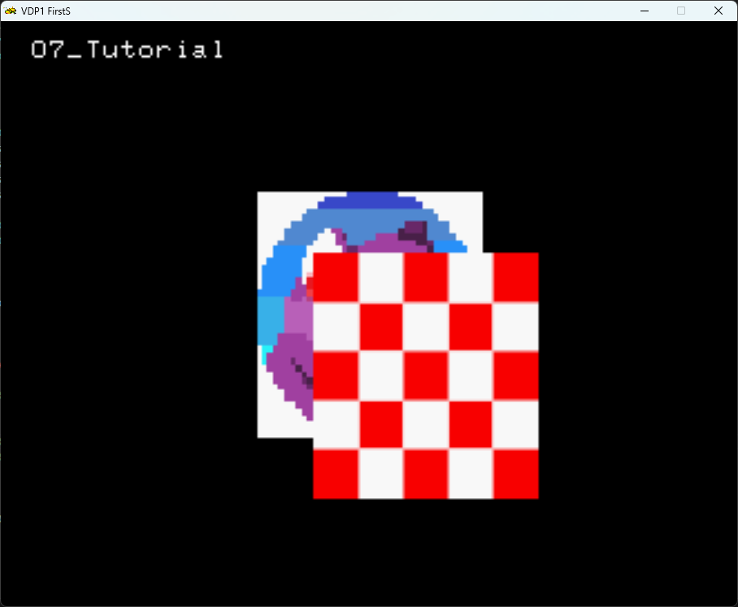

## Setting Effects

In order to set effects it is done via the `static void SRL::Scene2D::SetEffect(const SpriteEffect effect, const int32_t data = -1)` function [documentation](https://srl.reye.me/classSRL_1_1Scene2D_a2f702eaaf22b82345520cce09908f386.html#a2f702eaaf22b82345520cce09908f386).

### Half Transparency

And now lets set a Half Transparency effect.
To do so, we must use the function `SRL::Scene2D::SetEffect(SRL::Scene2D::SpriteEffect::HalfTransparency, true);` before our `SRL::Scene2D::DrawSprite` call.

The code then becomes:

```cpp
while(1)
 {       
        SRL::Scene2D::DrawSprite(textureIndex,  center_sprite, 50.0);                //draw the center sprite
        SRL::Scene2D::SetEffect(SRL::Scene2D::SpriteEffect::HalfTransparency, true); //Enable the effect
        SRL::Scene2D::DrawSprite(chkTexture,  second_sprite, 50.0);                  //draw the offset sprite   
        SRL::Scene2D::SetEffect(SRL::Scene2D::SpriteEffect::HalfTransparency);       //Disable the effect          
        SRL::Core::Synchronize();                                                    //Refresh screen
 }
```

The Result:

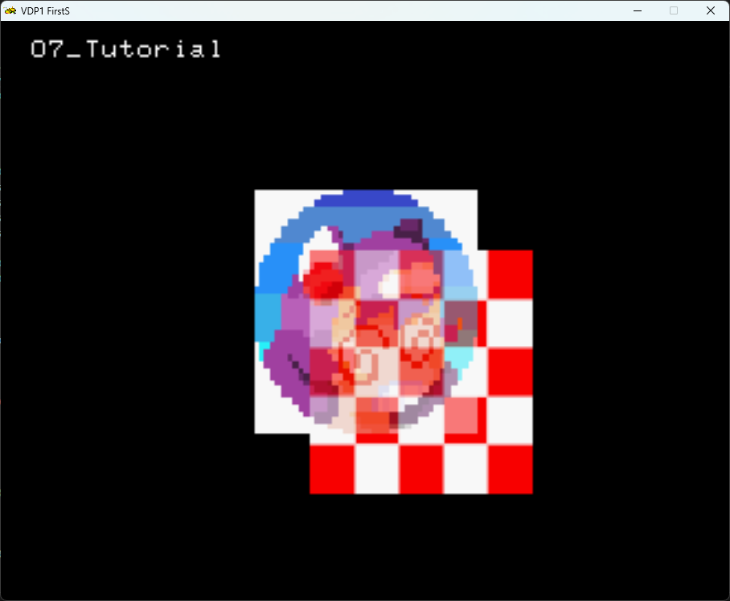

### Screen doors

For that Saturn look, look no further than the `ScreenDoors` effect.
For the `ScreenDoors` effect, you use the `SRL::Scene2D::SetEffect(SRL::Scene2D::SpriteEffect::ScreenDoors, true);` function.

```cpp
while(1)
 {       
        SRL::Scene2D::SetEffect(SRL::Scene2D::SpriteEffect::ScreenDoors, true); //Enable the effect
        SRL::Scene2D::DrawSprite (textureIndex,  center_sprite, 50.0);        //draw the center sprite
        SRL::Scene2D::DrawSprite (chkTexture,  second_sprite, 50.0);          //draw the offset sprite   
        SRL::Scene2D::SetEffect(SRL::Scene2D::SpriteEffect::ScreenDoors);       //Disable the effect          
        SRL::Core::Synchronize();                                               //Refresh screen
 }
```

The Result:


### Combining effects

You can also combine `ScreenDoors` and `HalfTransparency`.

```cpp
while(1)
 {       
        SRL::Scene2D::SetEffect(SRL::Scene2D::SpriteEffect::HalfTransparency, true); //Enable the effect
        SRL::Scene2D::SetEffect(SRL::Scene2D::SpriteEffect::ScreenDoors, true);      //Enable the effect
        SRL::Scene2D::DrawSprite(textureIndex,  center_sprite, 50.0);             //draw the center sprite
        SRL::Scene2D::DrawSprite(chkTexture,  second_sprite, 50.0);               //draw the offset sprite   
        SRL::Scene2D::SetEffect(SRL::Scene2D::SpriteEffect::ScreenDoors);            //Disable the effect
        SRL::Scene2D::SetEffect(SRL::Scene2D::SpriteEffect::HalfTransparency);       //Disable the effect            
        SRL::Core::Synchronize();                                                    //Refresh screen
 }
```

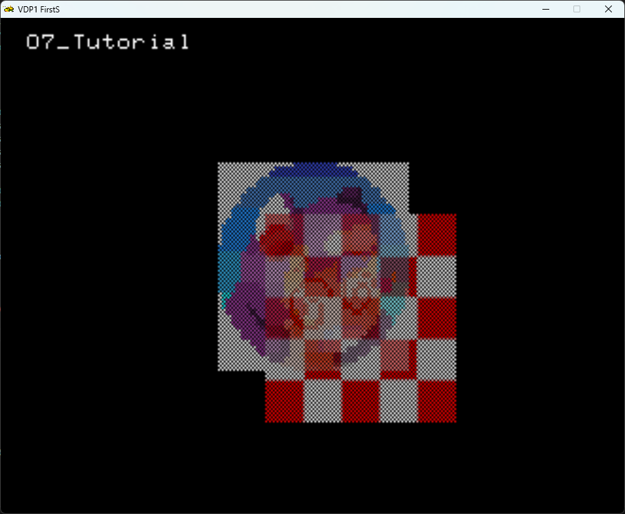

### Flip

The `Flip` effect is exactly what it says. This will flip the sprite on X, Y or both axis.

For example:

#### `SRL::Scene2D::FlipEffect::HorizontalFlip`

```cpp
while(1)
 {       
        SRL::Scene2D::SetEffect(SRL::Scene2D::SpriteEffect::Flip, SRL::Scene2D::FlipEffect::HorizontalFlip); //Enable the effect    
        SRL::Scene2D::DrawSprite ( textureIndex,  center_sprite, 50.0 );             //draw the center sprite 
        SRL::Scene2D::SetEffect(SRL::Scene2D::SpriteEffect::Flip);                   //Disable the effect            
        SRL::Core::Synchronize();                                                    // Refresh screen
 }
```

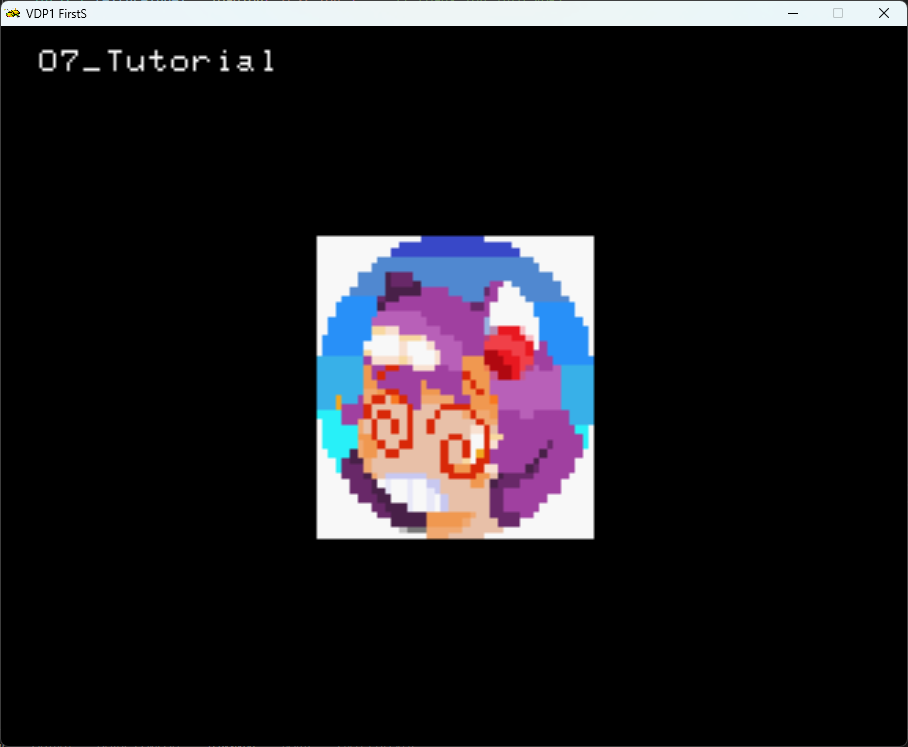

#### `SRL::Scene2D::FlipEffect::VerticalFlip`

```cpp
while(1)
 {       
        SRL::Scene2D::SetEffect(SRL::Scene2D::SpriteEffect::Flip, SRL::Scene2D::FlipEffect::VerticalFlip); //Enable the effect    
        SRL::Scene2D::DrawSprite ( textureIndex,  center_sprite, 50.0 );                                   //draw the center sprite   
        SRL::Scene2D::SetEffect(SRL::Scene2D::SpriteEffect::Flip);                                         //Disable the effect            
        SRL::Core::Synchronize();                                                                          // Refresh screen
 }
```

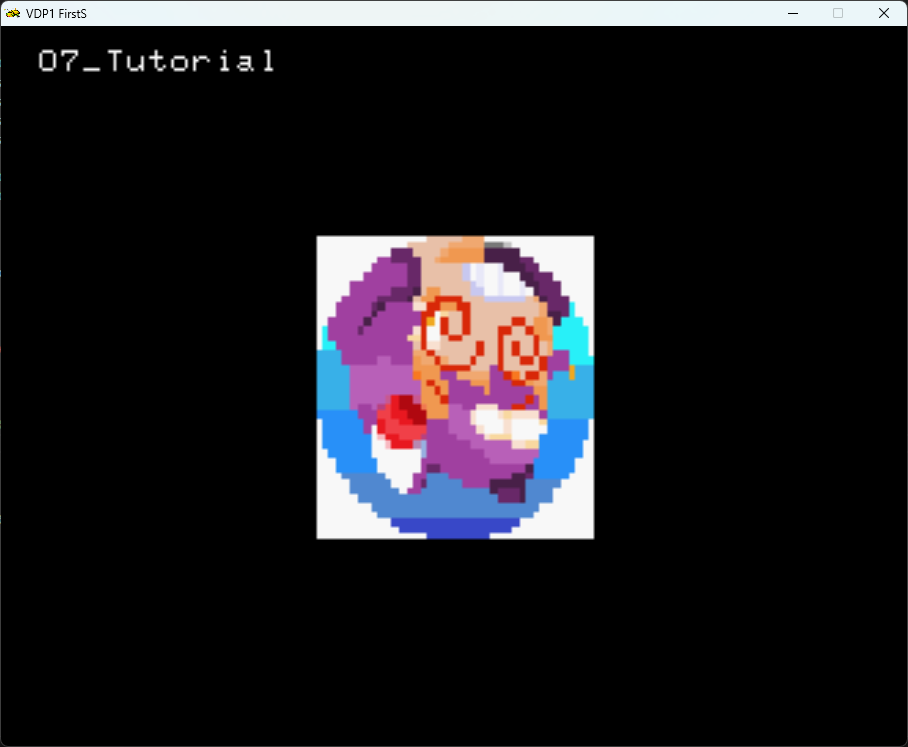

#### Combining both `SRL::Scene2D::FlipEffect::HorizontalFlip` and `SRL::Scene2D::FlipEffect::VerticalFlip`

```cpp
while(1)
 {       
        SRL::Scene2D::SetEffect(SRL::Scene2D::SpriteEffect::Flip, SRL::Scene2D::FlipEffect::VerticalFlip | SRL::Scene2D::FlipEffect::HorizontalFlip);   
        SRL::Scene2D::DrawSprite ( textureIndex,  center_sprite, 50.0 );             //draw the center sprite   
        SRL::Scene2D::SetEffect(SRL::Scene2D::SpriteEffect::Flip);       //Disable the effect            
        SRL::Core::Synchronize();                                                    // Refresh screen
 }
```

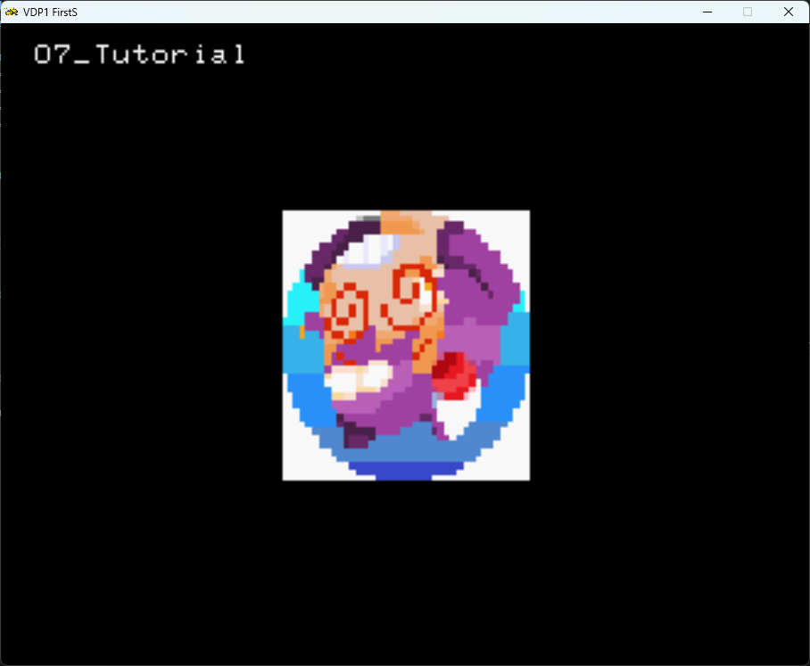

### Clipping

The clipping effect allows you to define a "clipping window", where you can set if the affected sprite is drawn inside or outside of it.

First we must define the clipping window.
This is done via the `static bool SRL::Scene2D::SetClippingRectangle(const SRL::Math::Types::Vector3D &location, const SRL::Math::Types::Vector2D &size )` function. [documentation](https://srl.reye.me/classSRL_1_1Scene2D_a73100f8cb69e1a46092bd997bc9aed3b.html#a73100f8cb69e1a46092bd997bc9aed3b).

We must provide the location of our clipping window and its size.

> [!WARNING]
> The top left corner of the screen is (0,0)!

> [!WARNING]
> If no Clipping Rectangle is specified, the sprites are not drawn.

After our clipping rectangle is defined, we can enable our clipping.
And there are 3 clipping modes to choose from:

### `SRL::Scene2D::ClippingEffect::ClipInside`

It will clip top sprite inside of the clipping window.
In our example, it will show the sprite underneath the sprite that was drawn on top.

The code becomes:

```cpp
Vector3D clip_square = Vector3D(160.0 , 120.0, 50); // holds center sprite position.
Vector2D square_size = Vector2D(50,50);

// Main program loop
while(1)
        {       
                SRL::Scene2D::SetClippingRectangle(clip_square, square_size);
                SRL::Scene2D::DrawSprite ( textureIndex,  center_sprite, 50.0 );             //draw the center sprite 
                SRL::Scene2D::SetEffect(SRL::Scene2D::SpriteEffect::Clipping, SRL::Scene2D::ClippingEffect::ClipInside);
                SRL::Scene2D::DrawSprite ( chkTexture,  second_sprite, 50.0 );               //draw the offset sprite   
                SRL::Scene2D::SetEffect(SRL::Scene2D::SpriteEffect::Clipping);                
                SRL::Core::Synchronize();                                                    // Refresh screen
 }
```

The result:

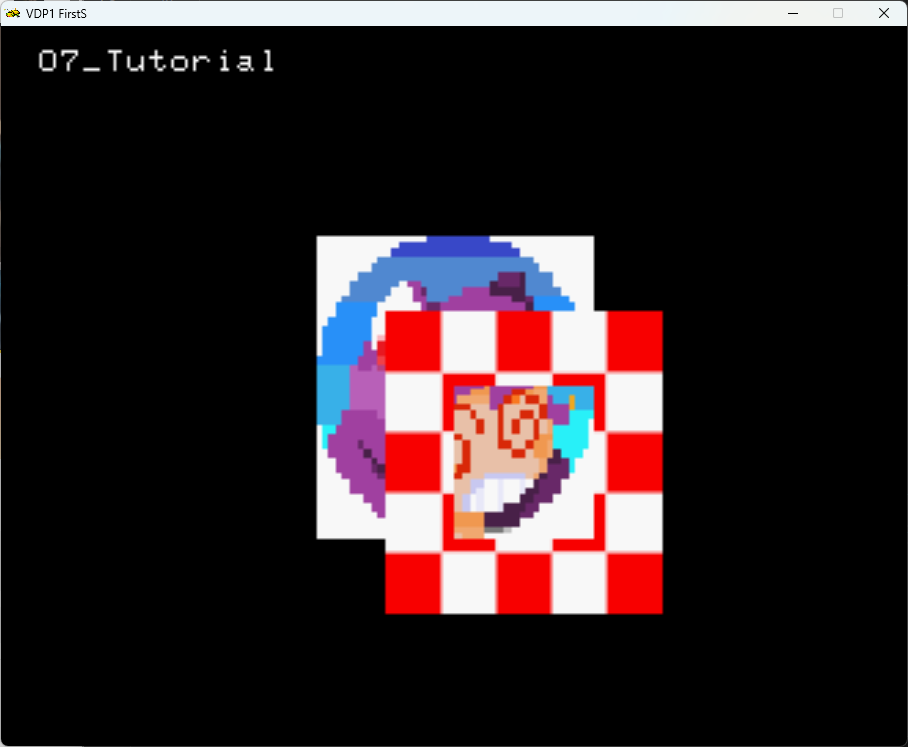

### `SRL::Scene2D::ClippingEffect::ClipOutside`

The `SRL::Scene2D::ClippingEffect::ClipOutside` option will clip everything that is outside of the clipping window.

The code below:

```cpp
Vector3D clip_square = Vector3D(160.0 , 120.0, 50); // holds center sprite position.
Vector2D square_size = Vector2D(50,50);

// Main program loop
while(1)
 {       
                SRL::Scene2D::SetClippingRectangle(clip_square, square_size);
                SRL::Scene2D::DrawSprite ( textureIndex,  center_sprite, 50.0 );             //draw the center sprite 
                SRL::Scene2D::SetEffect(SRL::Scene2D::SpriteEffect::Clipping, SRL::Scene2D::ClippingEffect::ClipOutside);
                SRL::Scene2D::DrawSprite ( chkTexture,  second_sprite, 50.0 );               //draw the offset sprite   
                SRL::Scene2D::SetEffect(SRL::Scene2D::SpriteEffect::Clipping);                
                SRL::Core::Synchronize();                                                    // Refresh screen
 }
```

Result:


### Gouraud

Gouraud Shading is a shading technique where colors are interpolated along vertices.
Before using the gouraud effect, we must first create a gouraud table.
This table contains color values to be used.
And then, when enabling the effect, we refer the table entry index for the first color to be applied.
To every vertex of the quad will applied the next color on the Gouraud Table.

This is done by means of:

```cpp
// Define Gouraud Table
HighColor* table = SRL::VDP1::GetGouraudTable();
table[0] = HighColor::Colors::Blue;
table[1] = HighColor::Colors::Green;
table[2] = HighColor::Colors::Yellow;
table[3] = HighColor::Colors::Magenta;
```

And we enable the effect by:

```cpp
while(1)
{       
        SRL::Scene2D::SetEffect(SRL::Scene2D::SpriteEffect::Gouraud, 0);        //Use the 1st index of the Gouraud table
        SRL::Scene2D::DrawSprite ( textureIndex,  center_sprite, 50.0 );        //draw the center sprite  
        SRL::Scene2D::SetEffect(SRL::Scene2D::SpriteEffect::Gouraud);               
        SRL::Core::Synchronize();                                               // Refresh screen
}
```

This is the result:

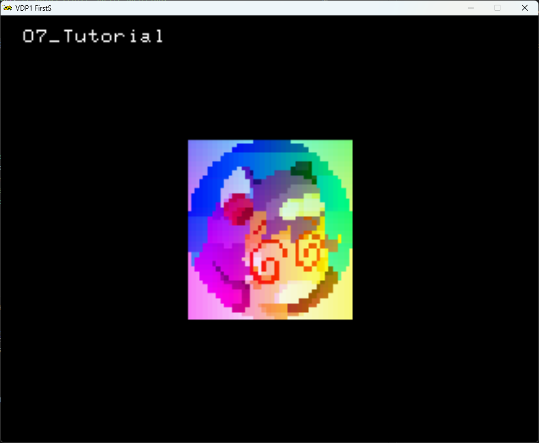

Notice that the table has `Blue` , `Green` , `Yellow` and `Magenta` values. And notice that the values are applied clockwise on the quad.

### EnableHSS

HSS (`High Speed Shrink`) speeds up sprite *downsizing* by only sampling the even, or odd, pixels.
This increases performance, at cost of some accuracy.

Lets draw 3 sprites: one at original size, one resized to half the size without HSS, and another one with HSS enabled.

```cpp

while(1)
{       
        SRL::Scene2D::DrawSprite(textureIndex, Vector3D(-120.0, 0.0, 500)); // Original sprite
        SRL::Scene2D::DrawSprite(textureIndex, Vector3D(0.0, 0.0, 500), Vector2D(0.7)); // Scaled sprite 
        SRL::Scene2D::SetEffect(SRL::Scene2D::SpriteEffect::EnableHSS, true);
        SRL::Scene2D::DrawSprite(textureIndex, Vector3D(120.0, 0.0, 500), Vector2D(0.7)); // Scaled sprite wth hss
        SRL::Scene2D::SetEffect(SRL::Scene2D::SpriteEffect::EnableHSS);
        SRL::Core::Synchronize();                                                    // Refresh screen
}

```

The Result:

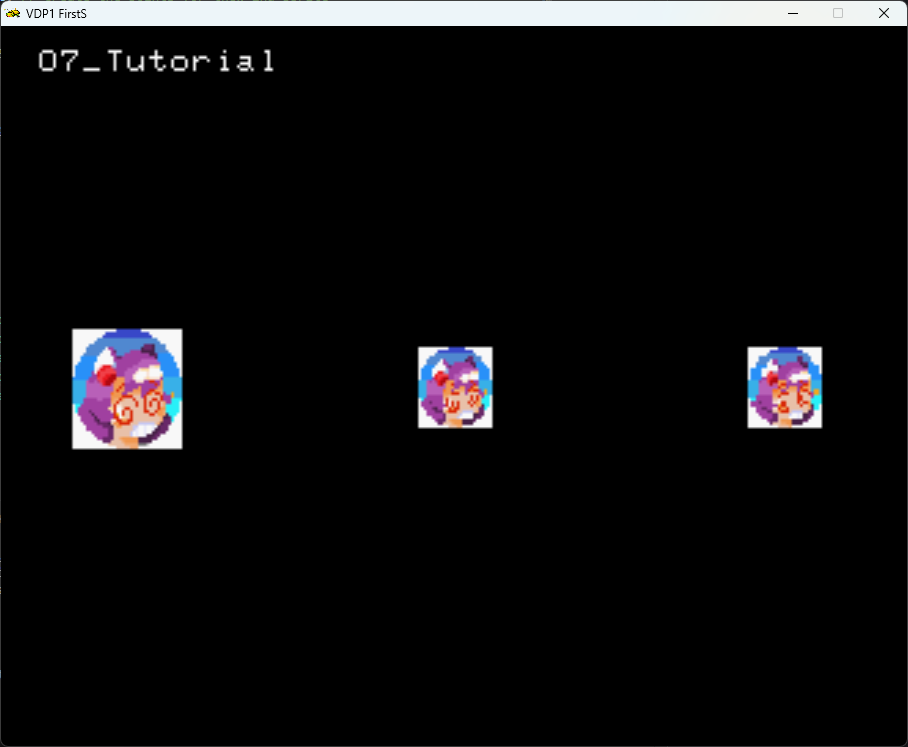

Upon close inspection, it becomes clear that the HSS version is slightly different from a non HSS one, however for most applications the performance gain is worth it.

### OpacityBank

To be covered after the VDP2 tutorials are written.

### EnableECD

`ECD` also referred as `end-code disable` , allows for finer control on what pixels are drawn.
When enabled, only the pixels between the end-codes on a *given line* are drawn. 
If there are 2 `ECD` at the both ends of the line, the whole line is skipped.
The end code is dependent on the color mode of the sprite.

However one must be mindful of the interaction between `EnableECD` and `EnableHSS`, specially when reducing the size of the sprite.

| HSS | ECD | End code processing |
| ------------- | ------------- | ------- |
| 0 | 0 | End code is valid, horizontal drawing ends with the second end code, End code will be transparent |
| 0 | 1 | End code invalid, end code not processed, the color comes out according to the code |
| 1 and enlarge | 0 | End code is valid, horizontal drawing ends with the second end code, End code will be transparent |
| 1 and reduce | 0 | End code invalid, end code not processed, The color comes out according to the code |
| 1 | 1 | End code invalid, end code not processed, The color comes out according to the code |

The end code it self is dependent on the color mode of the sprite:

| Color Mode | Description | End Code |
| ---------- | ----------- | -------- |
| 0 | 16 colors (color bank mode) | FH (4 bits) |
| 1 | 16 colors (lookup table mode) | FH (4 bits) |
| 2 | 64 colors (color bank mode) | FFH (8 bits) |
| 3 | 128 colors (color bank mode) | FFH (4 bits) |
| 4 | 256 colors (color bank mode) | FFH (8 bit) |
| 5 | 32768 colors (RGB mode) | 7FFFH (16 bit) |

For example for a 16 color mode image, lets us use the TGA below as an example:

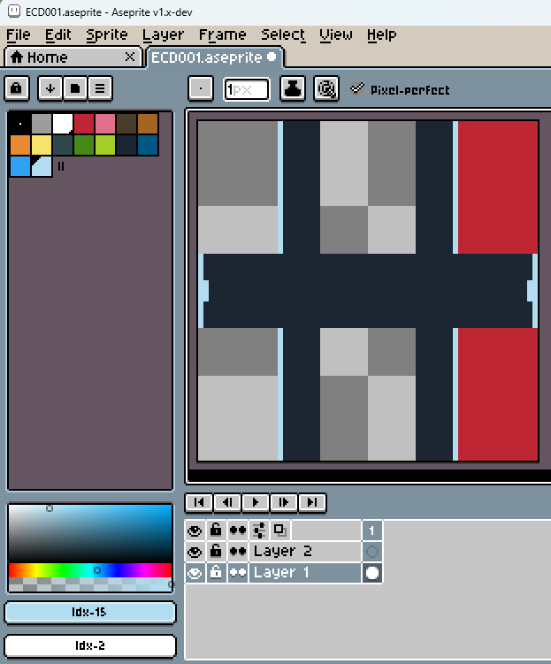

The First color is transparent, the last color of the palette corresponds to the End Code (for now onward we will refer to the End Code as `EC`).

> [!TIP]
> You might be asking why bother with `ECD` when you can simply use transparent pixels.
> The main reason is optimization: the use of `ECD` allows for the skipping up to a full line if needed.

One might also notice that the `loadTGA()` function mentioned on previous chapters won't load palette textures.

For completeness , this is a version of the `loadTGA()` that loads both color palette and RGB555 images:

```cpp
// Load color palettes here
int16_t LoadPalette(SRL::Bitmap::BitmapInfo* bitmap)
{
    // Get free CRAM bank
    int32_t id = SRL::CRAM::GetFreeBank(bitmap->ColorMode);

    if (id >= 0)
    {
        SRL::CRAM::Palette palette(bitmap->ColorMode, id);

        if (palette.Load((HighColor*)bitmap->Palette->Colors, bitmap->Palette->Count) >= 0)
        {
            // Mark bank as in use
            SRL::CRAM::SetBankUsedState(id, bitmap->ColorMode, true);
            return id;
        }

        return id;
    }

    // No free bank found
    return -1;
}

int32_t loadTGA(char* filename) //texture loading function
{
        SRL::Bitmap::TGA *tga = new SRL::Bitmap::TGA(filename); // Loads TGA file into main RAM
        SRL::Bitmap::BitmapInfo info = tga->GetInfo();          // Get info about the tga we are loading
        int32_t textureIndex = -1;
        
        if(info.ColorMode == SRL::CRAM::TextureColorMode::RGB555) // RGBA texture
        {
            textureIndex = SRL::VDP1::TryLoadTexture(tga);  // Loads TGA into VDP1
        }
        else
        {
            //assume is palleted texture
            textureIndex = SRL::VDP1::TryLoadTexture(tga, LoadPalette);
        }
        
        delete tga; 
        
        if (textureIndex == -1)
        {
            SRL::Debug::AssertScreen("Failed loading texture %s", filename, "loadTGA", filename);
        } 
        
        return textureIndex;
}
```

To enable `ECD` effect, one can simply do:

```cpp
while(1)
{       
    //Enable the effect
    SRL::Scene2D::DrawSprite(textureIndex,  center_sprite, 50.0);           //draw the center sprite
    SRL::Scene2D::SetEffect(SRL::Scene2D::SpriteEffect::EnableECD, true);   //Enable the effect
    SRL::Scene2D::DrawSprite(ecdTexture,  second_sprite, 50.0);             //draw the offset sprite   
    SRL::Scene2D::SetEffect(SRL::Scene2D::SpriteEffect::EnableECD);         //Disable the effect
    SRL::Core::Synchronize();                                               //Refresh screen                                           
}
```

And this is the result:

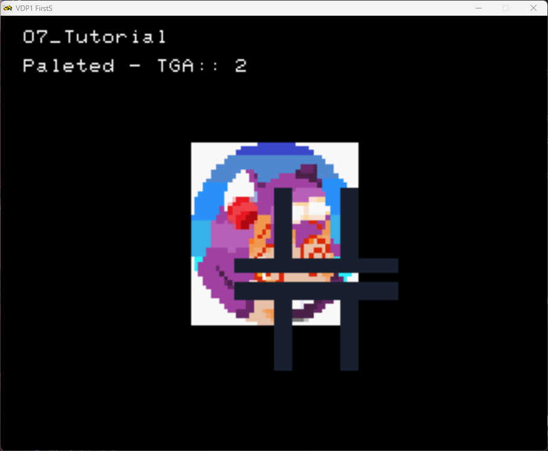


[Further Reference](https://docs.exodusemulator.com/Archives/SSDDV25/segahtml/index.html?page=hard/vdp1/hon/p06_34.htm)


### DisablePreClip
