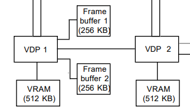
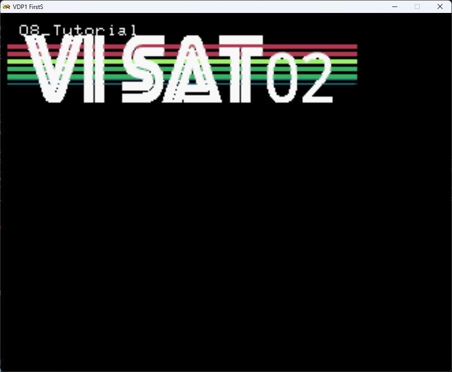
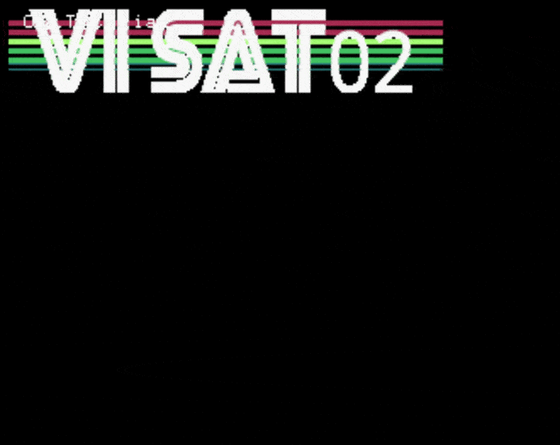

# A Primer on VDP2

While the VDP1 is responsible to draw the sprites in the foreground, the VDP2 is, in general, responsible to handle the backgrounds.
On the sega saturn, after the VDP1 draws the frame buffer, the image is handled over to the VDP2 for further processing.

The images on the VDP2 are referred to as screens.



The VDP2 supports 4 normal scroll screens and 2 rotation scroll screens.
The Rotation scroll screen will be dealt in a future tutorial.

In the table below there is an overview :

| Scroll Screen Name | Name | Notes |
| ------------------ | ---- | ----- |
| Normal Scroll Screen | NBG0 | Can move up/down/left/right. Can Scale |
| Normal Scroll Screen | NBG1 | Can move up/down/left/right. Can Scale |
| Normal Scroll Screen | NGB2 | Can move up/down/left/right. |
| Normal Scroll Screen | NGB3 | Can move up/down/left/right. |
| Rotation Scroll Screen | RBG0 | Can Rotate / Scale |
| Rotation Scroll Screen | RBG1 | Can Rotate / Scale |

## Screen formats

There are 2 screen formats:

- Bitmap format
- Cell format

### Bitmap format

This is the most simple way to have a image into the VDP2.
The bitmap data is placed into a VDP2 screen.

SRL provides, through the `SRL::VDP2` namespace the methods to interact and set or VDP2 scroll screens.

On SRL, we can do so by , for example for the NBG1 screen:

```cpp
SRL::Bitmap::TGA* logo = new SRL::Bitmap::TGA("TITLE.TGA"); //Load Bitmap image to work RAM
SRL::VDP2::NBG1::LoadBitmap(logo);                          // Load Bitmap into NGB1                                        
delete logo;                                                //free original bitmap from work ram
```

There are some caveats when using [`LoadBitmap`](https://srl.reye.me/classSRL_1_1VDP2_1_1BmpScreen_a731038a2273de70dafaf30a3c5a9f7c2.html#a731038a2273de70dafaf30a3c5a9f7c2) function:

- The bitmap can only have the following sizes :  512x256, 512x512, 1024x256, or 1024x512
- The maximum supported loading size is 2 VRAM banks (262,144 bytes)

The relation between bit depth and VRAM usage is shown below.

| Bitdepth | Max Image Size | VRAM Usage |
| -------- | -------------- | ---------- |
| 4bpp | 1024x512 | 1/2, 1, or 2 banks |
| 8bpp | 512x512 or 1024x256 | 1 or 2 banks |
| 16bpp | 512x256 | Always 2 banks |

And to draw the VDP2 Scroll Screen we must call, on our render loop:

```cpp
SRL::VDP2::NBG1::SetPriority(SRL::VDP2::Priority::Layer2);  //set NBG1 priority
SRL::VDP2::NBG1::ScrollEnable();                            //enable display of NBG1
SRL::Core::Synchronize();                                   //Refresh screen      
```

As we use more scroll screens, we must set on which priority they are drawn. The higher the layer, the higher the priority.
And we must enable the display of our scroll screen.

The Example Code becomes :

```cpp
int main()
{
    // Initialize library
    SRL::Core::Initialize(HighColor::Colors::Black);
    SRL::Debug::Print(1,1, "08_Tutorial");
     
    SRL::Bitmap::TGA* logo = new SRL::Bitmap::TGA("TITLE.TGA"); //Load Bitmap image to work RAM
    SRL::VDP2::NBG1::LoadBitmap(logo);                          // Load Bitmap into NGB1                                        
    delete logo;                                                //free original bitmap from work ram                                                                                   

    SRL::VDP2::NBG1::SetPriority(SRL::VDP2::Priority::Layer2);  //set NBG1 priority
    SRL::VDP2::NBG1::ScrollEnable();                            //enable display of NBG1

    // Main program loop
 while(1)
 {       
        SRL::Core::Synchronize();                                   //Refresh screen                                           
 }

 return 0;
}
```

And this is the result :



However we will what to manipulate out scroll screen (move, rotate, scale..)

### Translation:

For translation we use the [`SetPosition()`](https://srl.reye.me/classSRL_1_1VDP2_1_1NBG1_af78d57a49bd7ccc3f04e3b6769bacc20.html#af78d57a49bd7ccc3f04e3b6769bacc20) function.

For example, move our screen along the Y axis, this is what our `main()` function looks like:

```cpp
int main()
{
    // Initialize library
	SRL::Core::Initialize(HighColor::Colors::Black);
    SRL::Debug::Print(1,1, "08_Tutorial");
     
    SRL::Bitmap::TGA* logo = new SRL::Bitmap::TGA("TITLE.TGA"); //Load Bitmap image to work RAM
    SRL::VDP2::NBG1::LoadBitmap(logo);                          // Load Bitmap into NGB1                                        
    delete logo;                                                //free original bitmap from work ram                                                                                   

    Vector2D offset = Vector2D(0.0, -50.0);
    SRL::VDP2::NBG1::SetPriority(SRL::VDP2::Priority::Layer2);  //set NBG1 priority
    SRL::VDP2::NBG1::ScrollEnable();                            //enable display of NBG1

    // Main program loop
	while(1)
	{       
        SRL::VDP2::NBG1::SetPosition(offset);
        SRL::Core::Synchronize();                                   //Refresh screen                                           
        offset.Y = offset.Y - 1.0;
	}

	return 0;
}

```
And this is the result:

