# 3D Model pipeline in SRL

Before starting to use 3D into the sega saturn, there are some limitations to consider:

- There are no triangles - only quads (distorted sprites)
- There are no UV maps in the classical sense - each texture is fully mapped to the sprite / quad.
- Matrix operations are done on the CPU , drawing is done by VDP1
- Oh and up is -Y.

For using 3D models with SRL, there are 2 main tools we will be using in order to get 3D models into our saturn project :

- The `ModelObject.hpp` file that contains the `ModelObject` class. This can be found on the `SaturnRingLib\Samples\VDP1 - 3D - Flat teapot\src` folder.
- A file conversion utility from `.obj` format (Wavefront) into a binary `.NYA` file, that contains the model and textures when applicable. This tool can be found [here](https://github.com/ReyeMe/ModelConverter-linux). We will be using blender the generate and export the files.

## Preparing your first 3D Model

### Obtaining the converter tool

First we need the model converter tool. You can clone the repo and compile it your self, or download precompiled binary from the [releases section](https://github.com/ReyeMe/ModelConverter-linux/releases).

> [!NOTE]
> Despite the name of the repository, it does work on windows.

### Preparing the our first model

For the Model we will start with a simple, slightly deformed cube, created in blender:

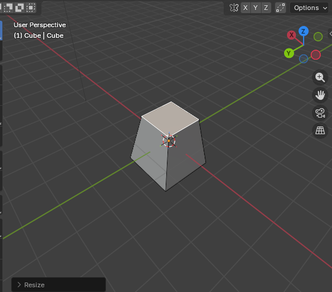

And we export it to `.obj` with the following settings:

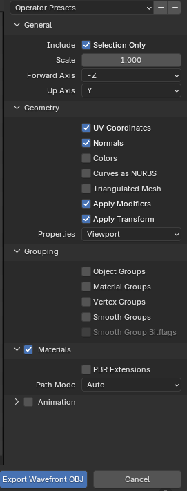

To convert our `.obj` to `.NYA` we use the following command:

```bash
PS D:\Development\Saturn\ModelConverter> .\ModelConverter.exe -i "..\SaturnRingLib\Projects\09_3D model_pipeline\assets\cube_01.obj" -o "..\SaturnRingLib\Projects\09_3D model_pipeline\cd\data\CUBE01.NYA"
Input files:
cube_01.obj
Output file: D:\Development\Saturn\SaturnRingLib\Projects\09_3D model_pipeline\cd\data\CUBE01.NYA
Using import plugin 'Wavefront' for 'cube_01.obj'
Using export plugin: NyaExport
Exporting type: 'NoLight'
UV mapping enabled: 'True'
UV mapping generated 0 texture
Texture data size 0 bytes
Export done
```

### Getting the model into our saturn project

We copy the resulting `.NYA` to the `cd/data` folder of our saturn project.

First we must include the `modelObject.hpp` at the top of our source file, and in our main function we instantiate the class.

```cpp
ModelObject cube = ModelObject("CUBE01.NYA");
```

We will also need coordinates for out camera. For this we use the `SRL::Math::Types::Vector3D`:

```cpp
Vector3D cameraLocation = Vector3D(12.5);
```

Operations regarding 3D Scenes are handled by the `SRL::Scene3D` namespace.

`SRL::Scene3D` namespace is responsible for the managing of 3D scene related resources. Its through this namespace that we access the 3D related functions.

`SRL::Scene3D` has an internal matrix stack, and a `LookAt` function , similar to OpenGl glu / glm.

At the start of our render loop we must load the *identity* matrix into the matrix stack. This is a matrix without transforms applied.
This is done via `SRL::Scene3D::LoadIdentity();`

To handle our camera, we must specify the camera´s coordinates, the position the camera is looking at, and the roll angle:

```cpp
SRL::Scene3D::LookAt(cameraLocation, Vector3D(), Angle::FromDegrees(0.0));
```

> [!NOTE]
> `Vector3D()` = `Vector3D(0.0)` = `Vector3D(0.0 , 0.0 , 0.0)`. Documentation can be found [here](https://srl.reye.me/structSRL_1_1Math_1_1Types_1_1Vector3D.html). 

And finally, to get out 3D model drawn, we invoke the `Draw()` method of our `ModelObject` instance, and then , at the end, call `SRL::Core::Synchronize();` at the end of the render loop.

```cpp
cube.Draw();
SRL::Core::Synchronize();   
```

Our source file then becomes:

```cpp
#include <srl.hpp>
#include "modelObject.hpp"

// Using to shorten names for Vector and HighColor
using namespace SRL::Types;
using namespace SRL::Math::Types;

int main()
{
    // Initialize library
    SRL::Core::Initialize(HighColor::Colors::Black);
    SRL::Debug::Print(1,1, "09_Tutorial"); 
  
    ModelObject cube = ModelObject("CUBE01.NYA");
    Vector3D cameraLocation = Vector3D(12.5);
  
    // Main program loop
    while(1)
    {       
       // Load identity matrix
       SRL::Scene3D::LoadIdentity();

       // Set camera location and direction
       SRL::Scene3D::LookAt(cameraLocation, Vector3D(), Angle::FromDegrees(0.0));

       cube.Draw();
       SRL::Core::Synchronize();                                                
    }

    return 0;
}
```

And this is the result:

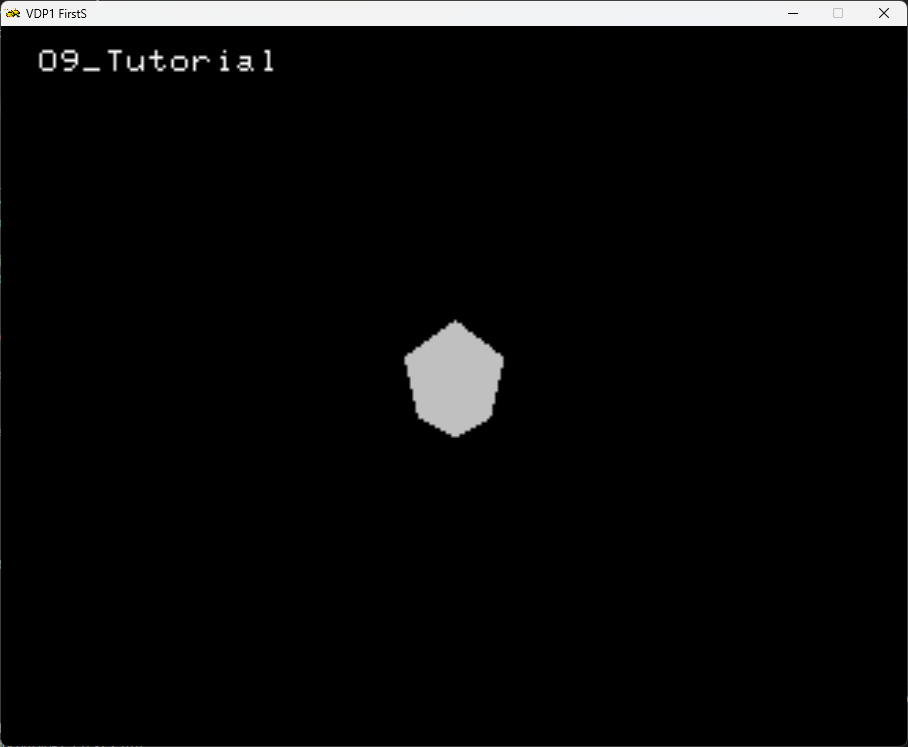

But its not very interesting, isn't it ?

### Basic lightning

Now we will make our cube *flat shaded*.

First we must export the model again, but with the `-t Flat` option.

```bash
PS D:\Development\Saturn\ModelConverter> .\ModelConverter.exe -i "..\SaturnRingLib\Projects\09_3D model_pipeline\assets\cube_01.obj" -o "..\SaturnRingLib\Projects\09_3D model_pipeline\cd\data\CUBE01.NYA" -t Flat
Input files:
cube_01.obj
Output file: D:\Development\Saturn\SaturnRingLib\Projects\09_3D model_pipeline\cd\data\CUBE01.NYA
Using import plugin 'Wavefront' for 'cube_01.obj'
Using export plugin: NyaExport
Exporting type: 'Flat'
UV mapping enabled: 'True'
UV mapping generated 0 texture
Texture data size 0 bytes
Export done.
```

And on the source file, we must add a coordinate for the light and enable the lightening:

```cpp
// Setup light, we can use scale of the vector to manipulate light intensity
Vector3D lightDirection = Vector3D(0.2, 0.0, 0.2);
SRL::Scene3D::SetDirectionalLight(lightDirection);
```

The resulting main function now becomes:

```cpp
int main()
{
    // Initialize library
    SRL::Core::Initialize(HighColor::Colors::Black);
    SRL::Debug::Print(1,1, "09_Tutorial"); 
  
    ModelObject cube = ModelObject("CUBE01.NYA");
    Vector3D cameraLocation = Vector3D(12.5);
  
    // Setup light, we can use scale of the vector to manipulate light intensity
    Vector3D lightDirection = Vector3D(0.2, 0.0, 0.2);
    SRL::Scene3D::SetDirectionalLight(lightDirection);

    // Main program loop
    while(1)
    {       
       // Load identity matrix
       SRL::Scene3D::LoadIdentity();

       // Set camera location and direction
       SRL::Scene3D::LookAt(cameraLocation, Vector3D(), Angle::FromDegrees(0.0));

       cube.Draw();
       SRL::Core::Synchronize();                                                
    }

    return 0;
}
```

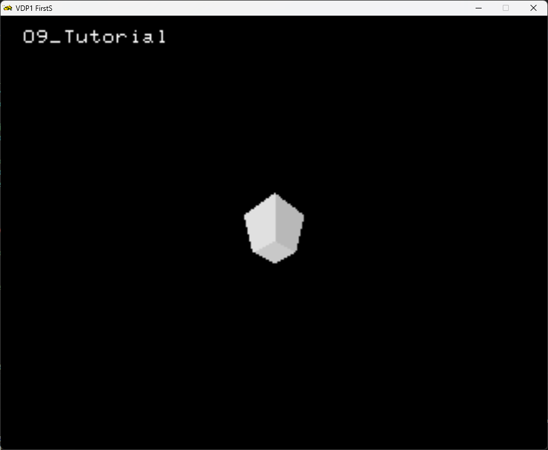

Much better!

However, you might have notices our mesh is....upside down. on the sega saturn, -Y is up.
However, we can always, upon export to set -Y as UP in blender.

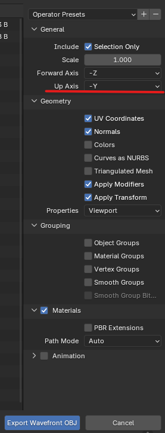

And the result:

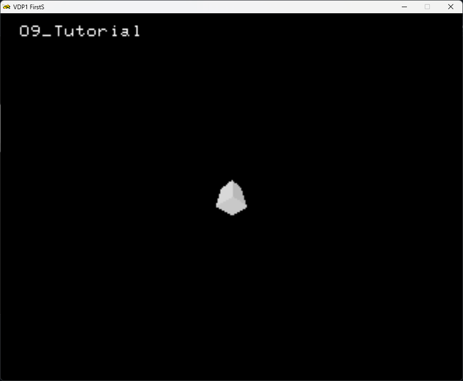

And of course, you can infer that we were looking at the cube from underneath due to the positive Y coordinate on the `cameraLocation` vector : `(12.5, 12.5, 12.5)`.

> [!NOTE]
> `Vector3D(12.5)` is the same as `Vector3D(12.5, 12.5, 12.5)`

Lets change the Y to -Y :

```cpp
Vector3D cameraLocation = Vector3D(12.5, -12.5, 12.5);
```
The result:

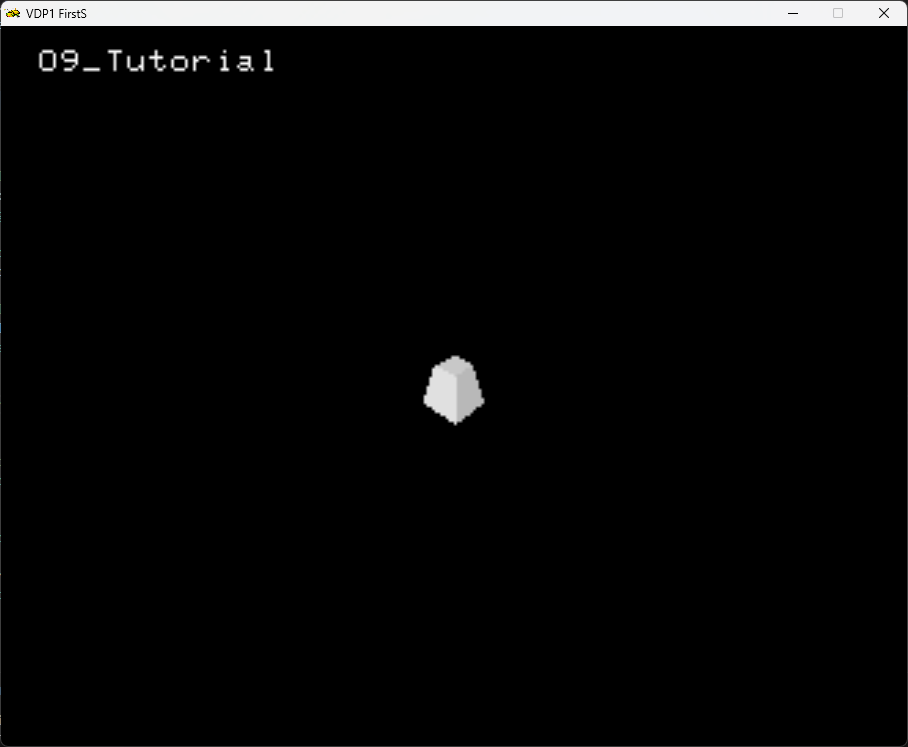


## Transforms

### Rotation

For rotation, we must define an `SRL::Math::Types::Angle` variable. We also declare a variable to define by how much the angle must increase at each frame.

```cpp
Angle rotation = 0;
Angle rotationStep = Angle::FromDegrees(1);
```

For the rotation we can use the `SRL::3DScene::RotateX` , `SRL::3DScene::RotateY`, `SRL::3DScene::RotateZ` functions. Behind the scenes the `Rotation` functions create a rotation matrix and applies it to the current scene.

For example, to rotate along the Y axis we do so by :

```cpp
 SRL::Scene3D::RotateY(rotation);
```

If we take a look at out main function now:

```cpp
int main()
{
    // Initialize library
    SRL::Core::Initialize(HighColor::Colors::Black);
    SRL::Debug::Print(1,1, "09_Tutorial"); 
  
    ModelObject cube = ModelObject("CUBE01.NYA");
    Vector3D cameraLocation = Vector3D(12.5, -12.5, 12.5);
  
    // Setup light, we can use scale of the vector to manipulate light intensity
    Vector3D lightDirection = Vector3D(0.2, 0.0, 0.2);
    SRL::Scene3D::SetDirectionalLight(lightDirection);

    // Initialize rotation angle
    Angle rotation = 0;
    Angle rotationStep = Angle::FromDegrees(1);

    // Main program loop
    while(1)
    {       
       // Load identity matrix
       SRL::Scene3D::LoadIdentity();
       // Set camera location and direction
       SRL::Scene3D::LookAt(cameraLocation, Vector3D(), Angle::FromDegrees(0.0));
       SRL::Scene3D::RotateY(rotation);
       cube.Draw();
       SRL::Core::Synchronize();       
       rotation+= rotationStep;
    }

    return 0;
}
```

The Result:

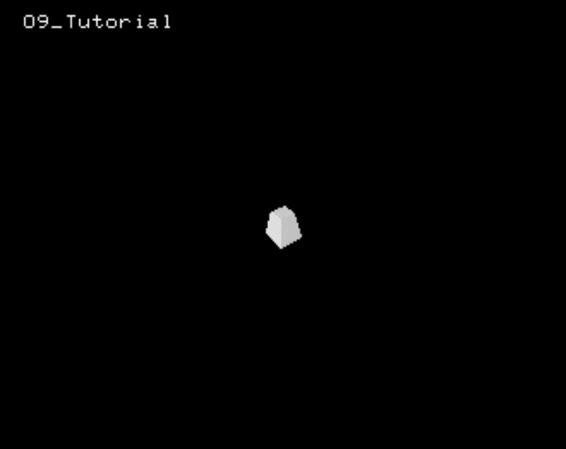

## Scaling

For scaling , `SRL::Scene3D` provides the `SRL::Scene3D::Scale` function.

There are 3 overrides for the `SRL::Scene3D::Scale`, that can be found in SRL's [documentation](https://srl.reye.me/classSRL_1_1Scene3D.html)

```cpp
int main()
{
    // Initialize library
    SRL::Core::Initialize(HighColor::Colors::Black);
    SRL::Debug::Print(1,1, "09_Tutorial"); 
  
    ModelObject cube = ModelObject("CUBE01.NYA");
    Vector3D cameraLocation = Vector3D(12.5, -12.5, 12.5);
  
    // Setup light, we can use scale of the vector to manipulate light intensity
    Vector3D lightDirection = Vector3D(0.2, 0.0, 0.2);
    SRL::Scene3D::SetDirectionalLight(lightDirection);

    // Initialize rotation angle
    Angle rotation = 0;
    Angle rotationStep = Angle::FromDegrees(1);

    Fxp scale = 2.0;
        // Main program loop
    while(1)
    {       
       // Load identity matrix
       SRL::Scene3D::LoadIdentity();
       // Set camera location and direction
       SRL::Scene3D::LookAt(cameraLocation, Vector3D(), Angle::FromDegrees(0.0));
       SRL::Scene3D::Scale(scale);
       SRL::Scene3D::RotateY(rotation);
       cube.Draw();
       SRL::Core::Synchronize();       
       rotation+= rotationStep;
    }

    return 0;
}
```

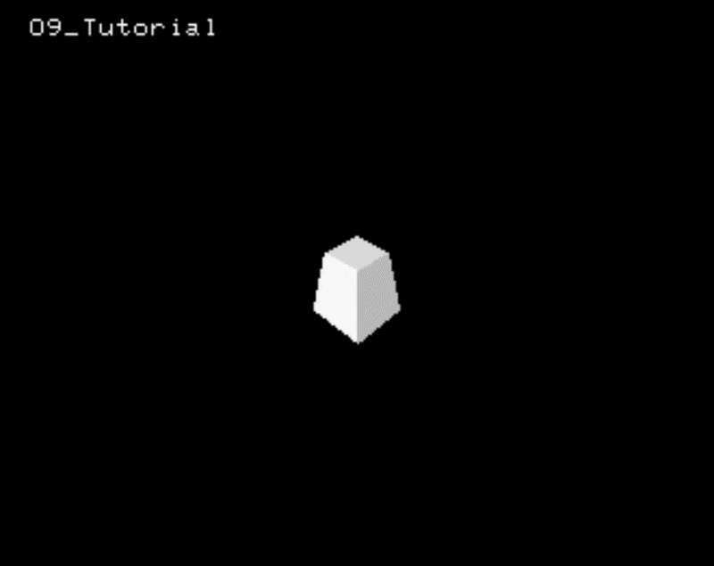

## Translation

For translation , `SRL::Scene3D` provides the `SRL::Scene3D::Translate` function. It can take a `SRL::Type::Vector3D` or 3 discrete `Fxp` scalars.

```cpp
int main()
{
    // Initialize library
    SRL::Core::Initialize(HighColor::Colors::Black);
    SRL::Debug::Print(1,1, "09_Tutorial"); 
  
    ModelObject cube = ModelObject("CUBE01.NYA");
    Vector3D cameraLocation = Vector3D(12.5, -12.5, 12.5);
  
    // Setup light, we can use scale of the vector to manipulate light intensity
    Vector3D lightDirection = Vector3D(0.2, 0.0, 0.2);
    SRL::Scene3D::SetDirectionalLight(lightDirection);

    // Initialize rotation angle
    Angle rotation = 0;
    Angle rotationStep = Angle::FromDegrees(1);

    //Vector for translation
    Vector3D position = Vector3D();

// Main program loop
    while(1)
    {       
       position.X = -2.0 ;
       position.Z = 3.0 ;
       // Load identity matrix
       SRL::Scene3D::LoadIdentity();
       // Set camera location and direction
       SRL::Scene3D::LookAt(cameraLocation, Vector3D(), Angle::FromDegrees(0.0));
       SRL::Scene3D::Translate(position);
       SRL::Scene3D::RotateY(rotation);
       cube.Draw();
       SRL::Core::Synchronize();       
    }

    return 0;
}
```

The result:

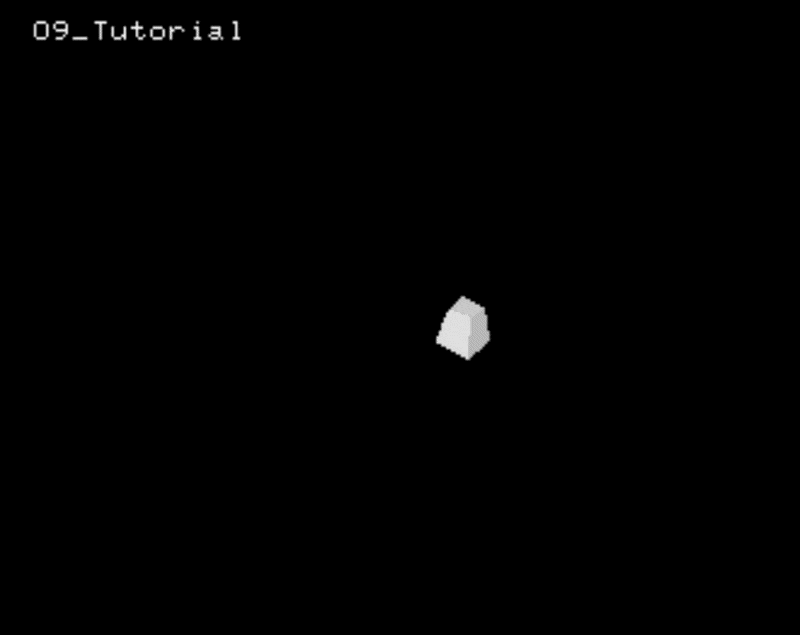

## Be mindful of Transform order

The 3D Transforms are nothing more that a product of matrices, and the programmer must remember that matrix operations are not commutative.

For example, if we take ou previous example , and swap the order of `SRL::Scene3D::Translate(position);` and `SRL::Scene3D::RotateY(rotation);`, the end result is very different :


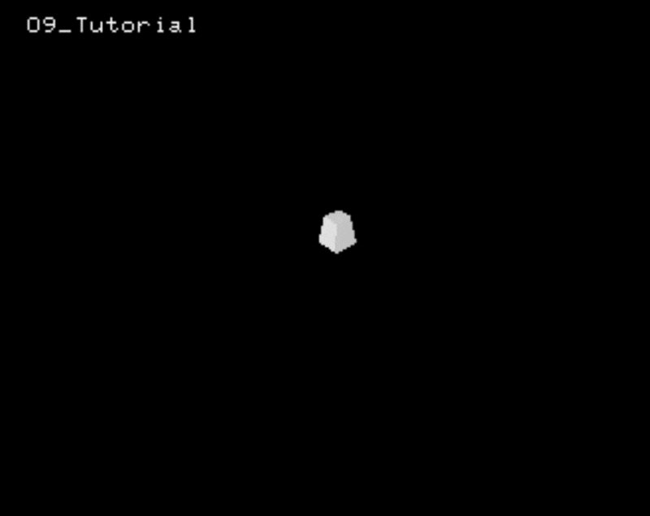

And you might have noticed, on the last animation, the when the object is too close to the camera, its faces disappeared.
Its is due to faces getting over the near clipping plane of the camera.

We can use the [`SRL::Scene3D::SetDepthDisplayLevel`](https://srl.reye.me/classSRL_1_1Scene3D_ac03e23772e5d362dd4a3f7b77d02b797.html#ac03e23772e5d362dd4a3f7b77d02b797) function.

In our example, we set `SRL::Scene3D::SetDepthDisplayLevel(4);`  , before the main loop, in order to set our Near Clipping plane (Forward boundary surface in the documentation) in such a way that our object is kept within the far and near clipping planes.

And now we have the expected result:

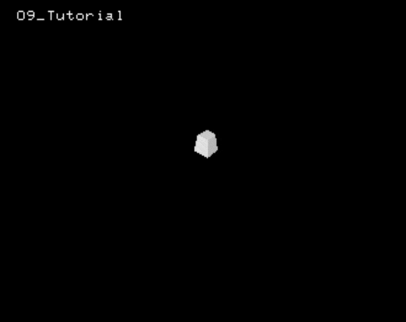
