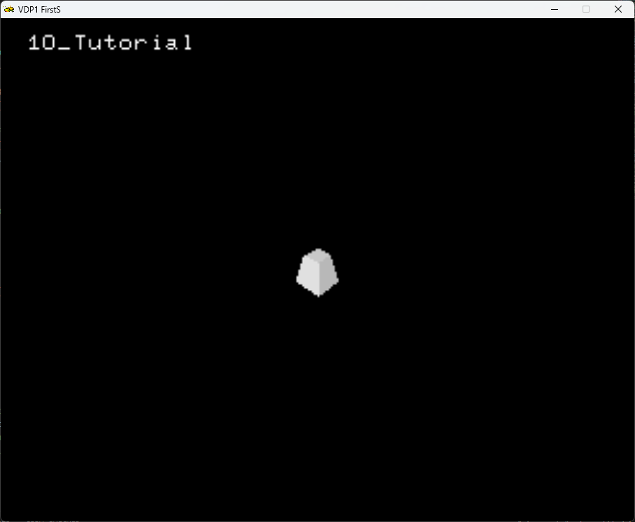
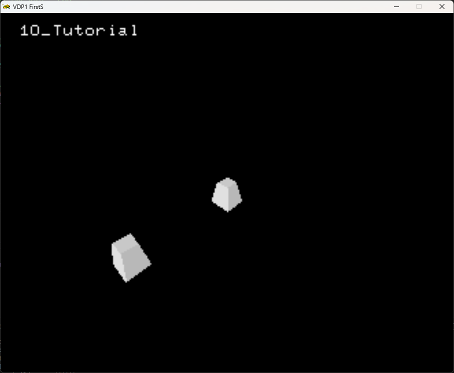
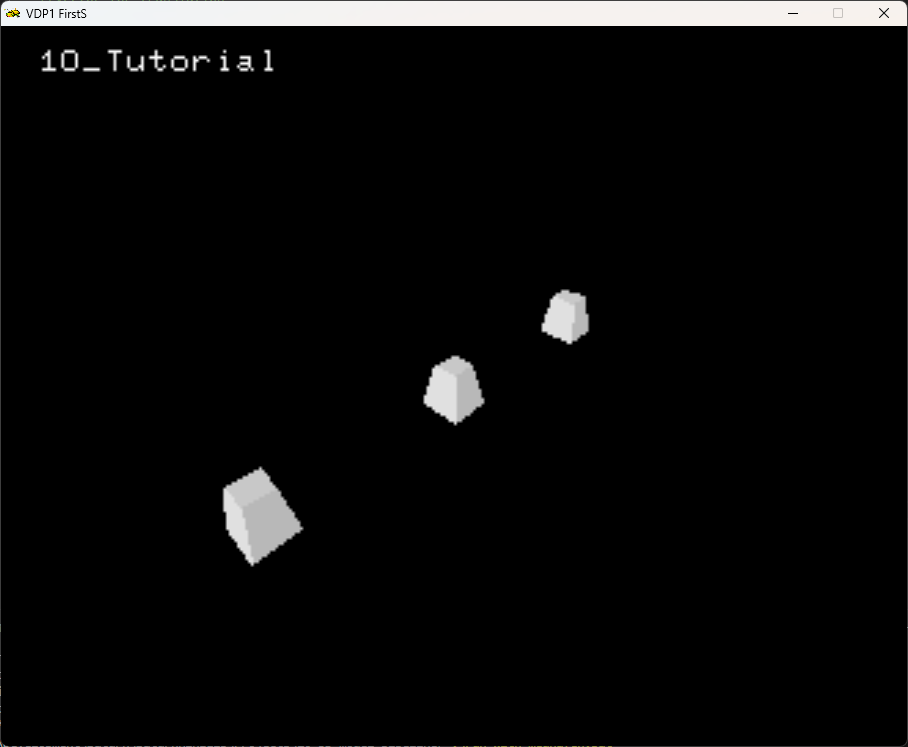
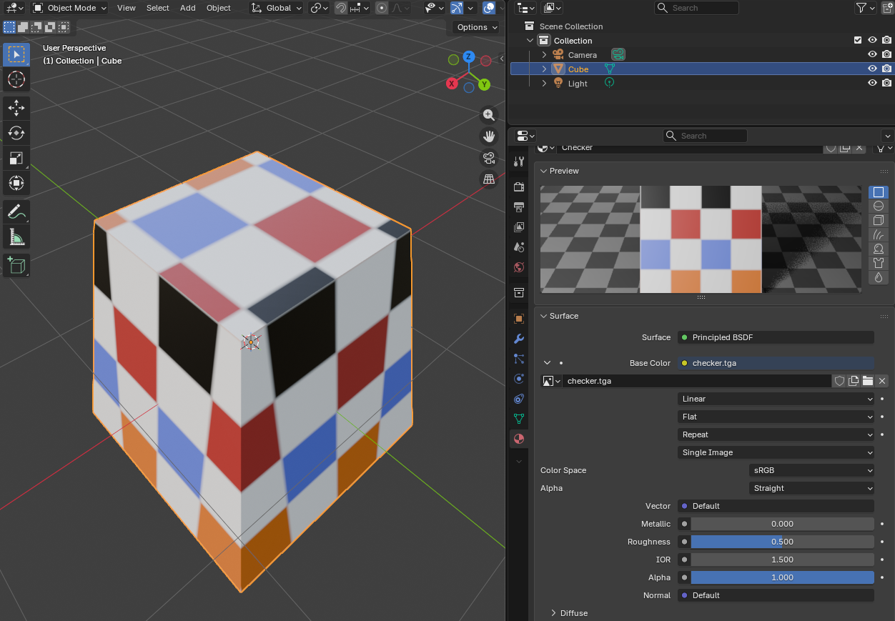
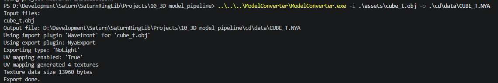
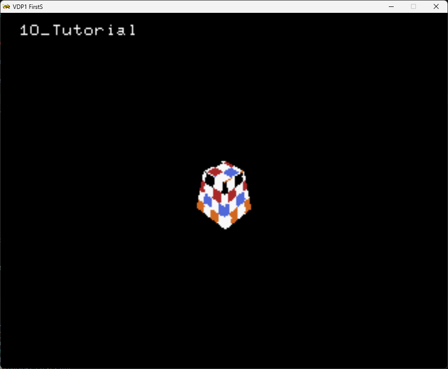
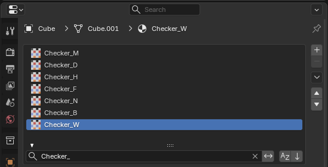
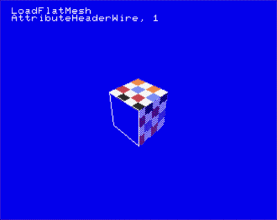

# 3D Model pipeline in SRL - Part 2

## The Matrix Stack

As we described on the [previous chapter](../09_3D_model_pipeline_part_1/09_3D_model_pipeline_part_1.md), when you call `SRL::Scene3D::Translate` , `SRL::Scene3D::Scale` and `SRL::Scene3D::Rotate`, what SRL does behind the scenes is to multiply the corresponding transform matrix with the SRL active matrix.

Then the mesh is transformed by this matrix when you call `Draw`: At this point SRL applies this matrix into the vertices of the model and then adds to the VDP1 command table the transformed vertices for rendering.

However, as you draw multiple objects, it might be useful to store the active matrix for later. There is an example below:

Lets go back to our baseline from chapter 10 :



Currently our model sits at `(0.0, 0.0, 0.0)`.

Lets draw another mesh at `(10.0, 0.0, 0.0)` , and another at `(-10, 0.0, 0.0)`.

```cpp
int main()
{
    // Initialize library
    SRL::Core::Initialize(HighColor::Colors::Black);
    SRL::Debug::Print(1,1, "10_Tutorial"); 
  
    ModelObject cube = ModelObject("CUBE01.NYA");
    Vector3D cameraLocation = Vector3D(12.5, -12.5, 12.5);
  
    // Setup light, we can use scale of the vector to manipulate light intensity
    Vector3D lightDirection = Vector3D(0.2, 0.0, 0.2);
    SRL::Scene3D::SetDirectionalLight(lightDirection);
    SRL::Scene3D::SetDepthDisplayLevel(4);

    // Main program loop
    while(1)
    {       
       // Load identity matrix
       SRL::Scene3D::LoadIdentity();
       // Set camera location and direction
       SRL::Scene3D::LookAt(cameraLocation, Vector3D(), Angle::FromDegrees(0.0));  
       cube.Draw();
       SRL::Scene3D::Translate(Vector3D(10.0, 0.0, 0.0));
       cube.Draw();
       SRL::Scene3D::Translate(Vector3D(-10.0, 0.0, 0.0));
       cube.Draw();
       SRL::Core::Synchronize();       
    }

    return 0;
}
```



We have only 2 meshes despite having 3 `Draw()` calls.
This is because all transform operations are done on top of all previous ones.
On this example, by doing `SRL::Scene3D::Translate(Vector3D(-10.0, 0.0, 0.0));` from `(10.0, 0.0, 0.0)`, we get back to `(0.0, 0.0, 0.0)`. Therefore drawing the 3rd mesh on top of the 1st one.

In order to work around this we save the current active matrix into a matrix stack. Think of a matrix stack as a stack where we save our current transforms, and allows us to easily revert back to it.

You will be mostly doing 2 operations with SRL's matrix stack : we can push a copy of the current active matrix into it, or retrieve it (pop).

When you pop a matrix from the stack, you remove the matrix from the top of the stack and set it as the active matrix.

> [!NOTE]
> The active matrix is the matrix that results from all the transforms applied to the scene !

You can push and pop the matrix stack using the `SRL::Scene3D::PushMatrix();` and `SRL::Scene3D::PopMatrix();`.

```cpp
int main()
{
    // Initialize library
    SRL::Core::Initialize(HighColor::Colors::Black);
    SRL::Debug::Print(1,1, "10_Tutorial"); 
  
    ModelObject cube = ModelObject("CUBE01.NYA");
    Vector3D cameraLocation = Vector3D(12.5, -12.5, 12.5);
  
    // Setup light, we can use scale of the vector to manipulate light intensity
    Vector3D lightDirection = Vector3D(0.2, 0.0, 0.2);
    SRL::Scene3D::SetDirectionalLight(lightDirection);    
    SRL::Scene3D::SetDepthDisplayLevel(4);

    // Main program loop
    while(1)
    {       
       // Load identity matrix
       SRL::Scene3D::LoadIdentity();
       // Set camera location and direction
       SRL::Scene3D::LookAt(cameraLocation, Vector3D(), Angle::FromDegrees(0.0));  
       cube.Draw();
       SRL::Scene3D::PushMatrix();  // Save the current transforms into the matrix stack
       SRL::Scene3D::Translate(Vector3D(10.0, 0.0, 0.0));
       cube.Draw();
       SRL::Scene3D::PopMatrix();   // Restored the current transforms from the matrix stack
       SRL::Scene3D::Translate(Vector3D(-10.0, 0.0, 0.0));
       cube.Draw();
       SRL::Core::Synchronize();       
    }

    return 0;
}
```

On the code example above, we push , by calling `SRL::Scene3D::PushMatrix();` , a copy of the active matrix into the matrix stack before doing further transforms.
After we are done, we revert to out initial position by performing a pop ,by calling `SRL::Scene3D::PopMatrix();`, where we retrieve our saved matrix from the stack and set it as active. Then we translate to `(-10.0, 0.0, 0.0)` and call `Draw()` to draw our 3rd mesh.



This applies to all transforms (rotation, scale, translate)

## Textures and UV maps

The sega saturn does not natively support UV maps.
The `NYA` format allows for texture storage, and UV mapping. However, since the saturn does not natively supports UV maps  the [`ModelConverter-linux`](https://github.com/ReyeMe/ModelConverter-linux) generates a new sprite texture for each unique UV region.

Therefore you can get a lot of texture memory being used if you are not careful.

First lets us prepare a 3D model.
To assign a texture, create a material, add a texture to the color slot :



The we use the model exporter to convert the OBJ to NYA.
Notice that on the `mtl` file refers to the texture file of the material. And that the `obj` , `mtl`, and the texture file (in this case a `tga`) are on the same folder.



> [!NOTE]
> Notice the exporter output : The tool generated 4 distinct texture for our model, in order to match the original model UV map!

> [!NOTE]
> As of 29.05.2026 only RGBA images are supported (no palette textures).

The final result (in ths case I've scaled the 3D mesh by a factor of 2 for better clarity):



## Face Attributes

As explained on [06_second_sprite](../07_sprite_effects/07_sprite_effects.md), sprites can have several attributes that define how the sprite is rendered, such has half transparency, screen doors effect, etc. This also applies, to an extent, to 3D model faces.

The attribute can be set by face, and are defined, in blender, by a suffix on the material name in the forma `_F` , there `F` is a flag defining the attribute of the face where the material is applied.

The supported flags are listed in the table below (table taken directly from the [`ModelConverter-linux`](https://github.com/ReyeMe/ModelConverter-linux) readme.md):

Flag    | Description
--------|-------------
M       | Mesh checkerboard transparency
D       | Face is double sided
H       | Half-transparent (50% VDP1 transparency)
F       | Force face to be flat shaded
N       | Force no light
B       | Half-bright (50% color brightness)
W       | Mesh face is rendered as outline wires (rendered as closed polyline)
C,L,-,+ | ``C`` = Sort by center of quad (default if -sort not set)<br/>``L`` = Same sort as last rendered quad<br/>``-`` = Sort by closest point<br/>``+`` = Sort by furthest point<br/>If not specified, sorting by center point is used

Example of material names in blender :



> [!WARNING]
> When Using the W attribute, the material must have only a solid color!
> If a texture is used with the W flag, the model will NOT be rendered!

Also, a single model can have different different attributes on each face:



