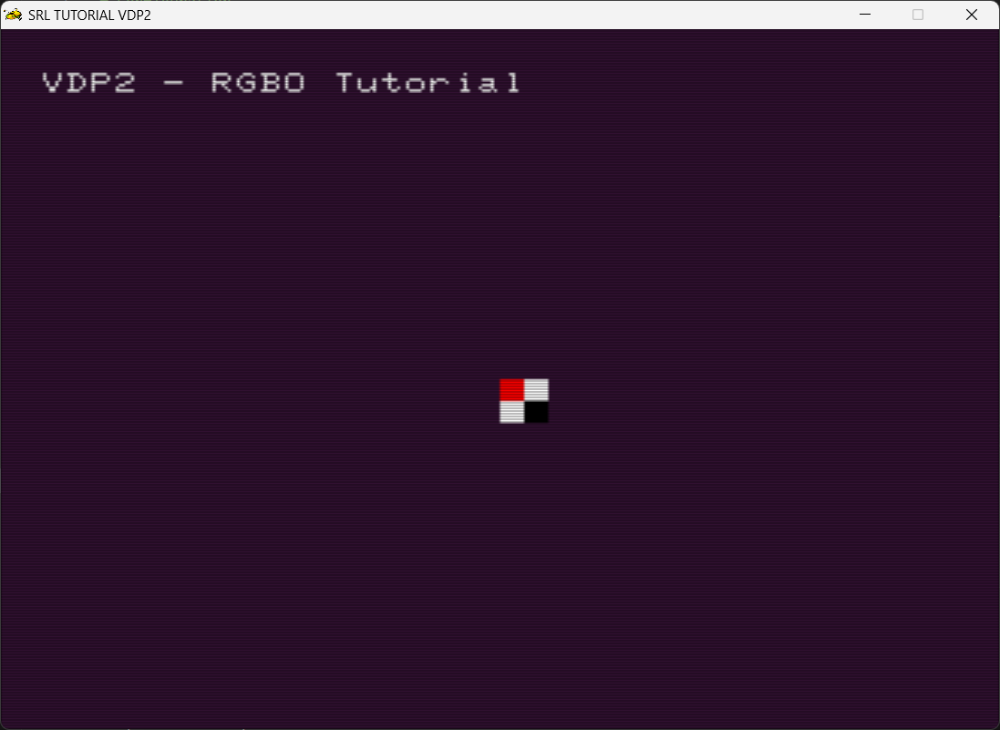
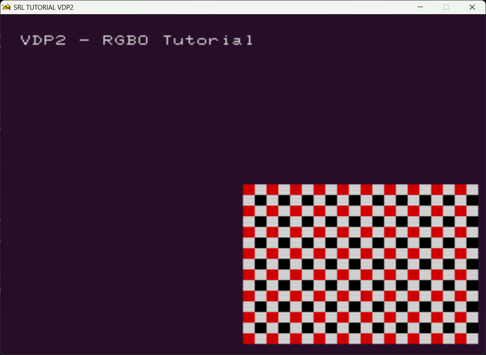
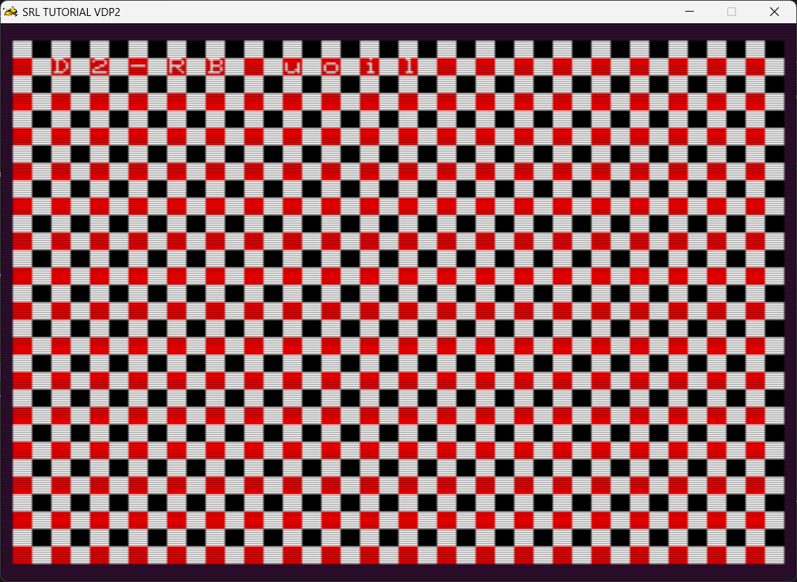
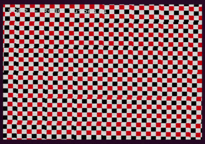
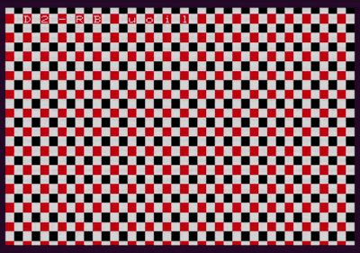
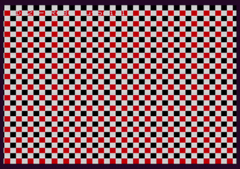
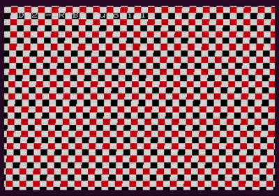
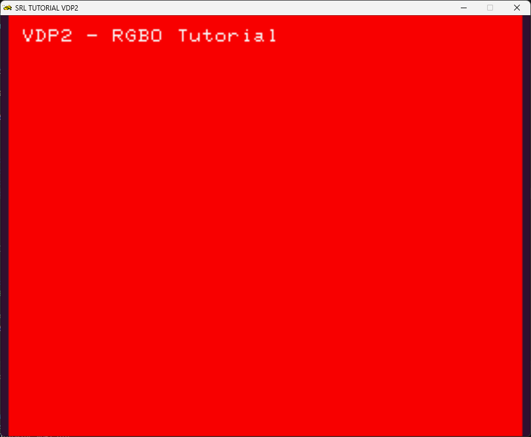

# A Primer on VDP2 RBG0 and RBG1

A reminder on VDP2 layers, covered on the [08_first_background](../08_first_background/08_first_background.md) :

In the table below there is an overview:

| Scroll Screen Name | Name | Notes |
| ------------------ | ---- | ----- |
| Normal Scroll Screen | NBG0 | Can move up/down/left/right. Can Scale |
| Normal Scroll Screen | NBG1 | Can move up/down/left/right. Can Scale |
| Normal Scroll Screen | NGB2 | Can move up/down/left/right. |
| Normal Scroll Screen | NGB3 | Can move up/down/left/right. |
| Rotation Scroll Screen | RBG0 | Can Rotate / Scale |
| Rotation Scroll Screen | RBG1 | Can Rotate / Scale |

What makes the `RBG0` and `RBG1` layers distinct is the ability to rotate.
This allows for effects such as the famous "MODE 7" effect on games like Mario Kart on the SNES.

### Diferences between Rotation scroll screen and normal scroll screens

While on the normal scroll screens, there are dedicated functions for translation, and scaling if applicable. For the rotation scroll screen, Scaling, Translation and Rotation are done by manipulation the SRL matrix stack, the same way you manipulate 3D scenes / objects, via `SRL::Scene3D::Scale()` , `SRL::Scene3D::Translate()` and `SRL::Scene3D::Rotate_()` functions.

You must call `SRL::VDP2::RBG0::SetCurrentTransform();` to apply the transform to rotation scroll screen.

## Baseline

Lets start with a simple scene:

```cpp

#include <srl.hpp>

// Using to shorten names for Vector and HighColor
using namespace SRL::Types;
using namespace SRL::Math::Types;

// Main program entry
int main()
{
    // Initialize library
    SRL::Core::Initialize(HighColor(0x31, 0x14, 0x32));
    SRL::Debug::Print(1,1, "VDP2 - RGB0 Tutorial");

    SRL::Bitmap::TGA* MyBmp = new SRL::Bitmap::TGA("CHK.TGA"); 
    SRL::Tilemap::Interfaces::Bmp2Tile* Tile = new SRL::Tilemap::Interfaces::Bmp2Tile(*MyBmp,1);
    delete MyBmp;
 
    SRL::VDP2::RBG0::LoadTilemap(*Tile);
    SRL::VDP2::RBG0::SetPriority(SRL::VDP2::Priority::Layer2);
    SRL::VDP2::RBG0::ScrollEnable();
   
   // Main program loop
	while(1)
	{
        SRL::Scene3D::LoadIdentity();
        SRL::VDP2::RBG0::SetCurrentTransform();
        
        // Refresh screen
        SRL::Core::Synchronize();

	}

	return 0;
}
```

This Loads a simple 16x16 tile into VDP2.

This is the result :



Note that we loaded the Identity Matrix into the SRL matrix stack. Then we applied it to RBG0 rotating plane by using `SRL::VDP2::RBG0::SetCurrentTransform();`

## Filling the scroll screen

As you noticed, having just a single image on VDP2 is not very interesting. You can make your own tilemaps as shown on [08_first_background](../08_first_background/08_first_background.md), or we can do it programatically.

SRL provides the [`CopyMap()`](https://srl.reye.me/structSRL_1_1Tilemap_1_1Interfaces_1_1Bmp2Tile_aadc8863cc9ea5ae0c4f1bfc663f06cde.html#aadc8863cc9ea5ae0c4f1bfc663f06cde) function to copy tilemap data *before* we load it into the corresponding VDP2 scroll screen.

For example :

```cpp
for(int i = 0 ; i < 16 ; i++)
    {
        for(int j = 0 ; j < 16 ; j++)
        {
           Tile->CopyMap(0,SRL::Tilemap::Coord(0,0), SRL::Tilemap::Coord(1,1), 0,SRL::Tilemap::Coord(i,j) );
        }
    }
```

Will copy our initial image along the tilemap : 16 times along x and 16 times along y.

The result :



However, where will be situations where you might want the image to tile along the *whole* scroll screen.

To do so, the total tile size must be 512 * 512.

Since our original tile map is 16*16, to cover 512x512 we must copy the original tile 32 times (512/16).

So if we modify our code to :

```cpp
for(int i = 0 ; i < 32 ; i++)
{
    for(int j = 0 ; j < 32 ; j++)
    {
        Tile->CopyMap(0,SRL::Tilemap::Coord(0,0), SRL::Tilemap::Coord(1,1), 0,SRL::Tilemap::Coord(i,j) );
    }
}
```

We now get :




## Rotation axis

First me must set the rotation axis. This is done via the `SetRotationMode()`.

There are 3 modes available :

| Enumerator | Description | Notes |
| -------- | -------------- | ---------- |
| OneAxis | 2d rotation with only roll and zoom | No additional VRAM requirements |
| TwoAxis | 3d rotation with pitch and yaw, but no roll (modified per line) | Requires 0x2000-0x18000 bytes in arbitrary VRAM Bank (No cycles) |
| ThreeAxis | Full 3d rotation with pitch, yaw and roll (modified per pixel) | Requires 0x2000-0x18000 bytes in Reserved VRAM bank (8 cycles) |


> [!NOTE]
> Be mindfull of the `SetRotationMode()` selected, and the respective rotation axis!

| Rotation Mode | Rotate X | Rotate Y | Rotate Z |
| ------------- | --------|  -------- | -------- |
| OneAxis      |  Scales in Y       | Scales in X        | Rotates as expected |
| TwoAxis      | ?        | ?        | ? |
| ThreeAxis    | ?        | ?        | ? |

### OneAxis Rotation

The plane is on the XY plane.
Therefore, to perform the expected rotation, we must rotate-it to the axis perpendicular to the XY plane : the Z axis.

In this example, we declare an angle variable and increment it at each frame.

The resulting code is :

```cpp
#include <srl.hpp>

// Using to shorten names for Vector and HighColor
using namespace SRL::Types;
using namespace SRL::Math::Types;

// Main program entry
int main()
{
    // Initialize library
	SRL::Core::Initialize(HighColor(0x31, 0x14, 0x32));
    SRL::Debug::Print(1,1, "VDP2 - RGB0 Tutorial");

    SRL::Bitmap::TGA* MyBmp = new SRL::Bitmap::TGA("CHK.TGA"); 
    SRL::Tilemap::Interfaces::Bmp2Tile* Tile = new SRL::Tilemap::Interfaces::Bmp2Tile(*MyBmp,1);
    delete MyBmp;


    for(int i = 0 ; i < 32 ; i++)
    {
        for(int j = 0 ; j < 32 ; j++)
        {
           Tile->CopyMap(0,SRL::Tilemap::Coord(0,0), SRL::Tilemap::Coord(1,1), 0,SRL::Tilemap::Coord(i,j) );
        }
    }
    
    SRL::VDP2::RBG0::LoadTilemap(*Tile);
    SRL::VDP2::RBG0::SetPriority(SRL::VDP2::Priority::Layer2);
    SRL::VDP2::RBG0::SetRotationMode(SRL::VDP2::RotationMode::OneAxis);
    SRL::VDP2::RBG0::ScrollEnable();


    Angle angle = 0;

    // Main program loop
	while(1)
	{
        SRL::Scene3D::LoadIdentity();
        SRL::Scene3D::RotateZ(angle);
        SRL::VDP2::RBG0::SetCurrentTransform();
        
        // Refresh screen
        SRL::Core::Synchronize();
        angle += Angle::FromDegrees(0.5);
	}

	return 0;
}
```

And this is the resulting image :



#### Rotations on non-perpendicular axis

What would happen if we rotated on a different axis than Z ?

##### Rotation no X

Causes distortion on Y axis.



##### Rotation on Y axis

Causes distortion on X axis.



##### Rotation on both axis

Combination of the both distortions above. Apparent rotation direction depends on transform order.




### Two Axis Rotation

If you just take the code from the One Axis rotation, and set the rotation mode to  `SRL::VDP2::RotationMode::TwoAxis` , you will simply get a distorted image, in this case red (due to the sprite used).



#### Applying transforms

In order to see the plane properly , we need to transform the plane.

> ![NOTE]
> We are assuming -Y is up
> We are assuming the standard rotation order : RotX , Rot Y and Rot Z.


### Three Axis Rotation

To use the 3 Axis mode we must set our rotation mode by using `SRL::VDP2::RBG0::SetRotationMode(SRL::VDP2::RotationMode::ThreeAxis);`.
After we set the transforms for our scene, we apply the transforms by using `SRL::VDP2::RBG0::SetCurrentTransform();`.

### A very simple plane


In our example, we will set a scene with a textured cube in the center, including lightning, with the RBG0 plane, with synchronized rotation between the cube and the plane. 

- Set a scene with a textured cube in the center, including lightning.
- Set the RBG0 plane.
- 
- And then render the cube on top of it.


Example code below :

```cpp
#include <srl.hpp>
#include "modelObject.hpp"

// Using to shorten names for Vector and HighColor
using namespace SRL::Types;
using namespace SRL::Math::Types;

// Main program entry
int main()
{
    // Initialize library
	SRL::Core::Initialize(HighColor(0x31, 0x14, 0x32));
    SRL::Debug::Print(1,1, "VDP2 - RGB0 Tutorial");

    ModelObject cube;
    cube.LoadFile("CUBE_X.NYA");
    Vector3D cameraLocation = Vector3D(12.5, -5.5, 12.5);

    Vector3D lightDirection = Vector3D(0.2, 0.0, 0.2);
    SRL::Scene3D::SetDirectionalLight(lightDirection);
    SRL::Scene3D::SetDepthDisplayLevel(4);


    SRL::Bitmap::TGA* MyBmp = new SRL::Bitmap::TGA("CHK.TGA"); 
    SRL::Tilemap::Interfaces::Bmp2Tile* Tile = new SRL::Tilemap::Interfaces::Bmp2Tile(*MyBmp,1);
    delete MyBmp;


    for(int i = 0 ; i < 32 ; i++)
    {
        for(int j = 0 ; j < 32 ; j++)
        {
           Tile->CopyMap(0,SRL::Tilemap::Coord(0,0), SRL::Tilemap::Coord(1,1), 0,SRL::Tilemap::Coord(i,j) );
        }
    }
    
    SRL::VDP2::RBG0::LoadTilemap(*Tile);
    SRL::VDP2::RBG0::SetPriority(SRL::VDP2::Priority::Layer2);
    SRL::VDP2::RBG0::SetRotationMode(SRL::VDP2::RotationMode::ThreeAxis);
    SRL::VDP2::RBG0::ScrollEnable();

    Angle angle = 0;


    // Main program loop
	while(1)
	{
        SRL::Scene3D::LoadIdentity();
        SRL::Scene3D::LookAt(cameraLocation, Vector3D(), Angle::FromDegrees(0.0));
        SRL::Scene3D::RotateX(Angle::FromDegrees(90.0));
        SRL::Scene3D::RotateZ(angle);
        SRL::VDP2::RBG0::SetCurrentTransform();        
        SRL::Scene3D::Scale(Vector3D(2.0)); 
        
        cube.Draw();
 
        // Refresh screen
        SRL::Core::Synchronize();
        
        angle += Angle::FromDegrees(0.5);
               
	}

	return 0;
}

```


