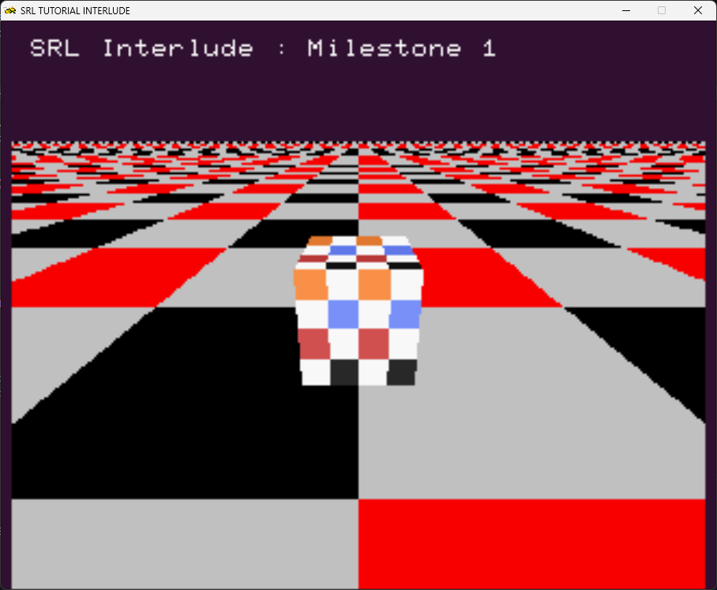
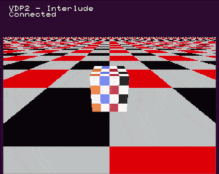
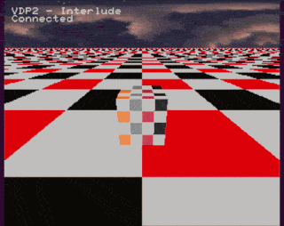
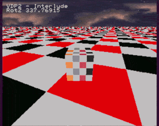

# 2nd Interlude : putting everything together in a simple project

## Main Goals

The main goal is to consolidate the topics covered on the previous tutorial series into a *simple* mario kart clone :

- Use VDP1 for sprites and 3D models
- Use VDP2 for background ,  ground plane and GUI elements
- Use Gamepad Input
- Make extensive use of C++ features (OOP)

In order to make this project we will start with the previous chapter as a baseline.

We will have classes representing the major blocks of the project, and a simple FSM (Finite state machine), to manage the state of the entities on it.

## A Primer on state machines

TODO

## Milestone 1

### Goals

The Goal of this milestone is to get the code of the [previous chapter](../11_second_background/11_second_background.md) and add user input.

In the end out cube must appear to run along the VDP2, based on user input.

All this while keeping the complexity manageable.

### Design

At this point we have 2 elements in the project :

- The cube.
- The VDP2 RBG0 plane.

The cube will be representing our *kart* (a cube for now), that will be represented into its own class, and the VDP2 RBG plane will represent the ground / track.
~
The camera will be behind the kart, and the kart will be at the center of the screen. Up and Down will move our cube forward and backward, relative to the cube's orientation, and Left and Right will rotate the cube along the Z axis.

### Implementation

#### Baseline

In order to represent the Kart, we will define the following class, into its own header :

```cpp

#pragma once
#include <srl.hpp>
#include "modelObject.hpp"

using namespace SRL::Types;
using namespace SRL::Math::Types;

class kart
{
    public :
    
    ModelObject mesh;
    Vector3D position = Vector3D();
    
    kart(const char* filename)
    {
        mesh.LoadFile(filename);
    };

    void Draw()
    {
        mesh.Draw();
    }
};

```

And we re-write our main file to make use of this class :

```cpp

#include <srl.hpp>
#include "modelObject.hpp"
#include "kart.hpp"

// Using to shorten names for Vector and HighColor
using namespace SRL::Types;
using namespace SRL::Math::Types;

int main()
{
    // Initialize library
    SRL::Core::Initialize(HighColor(0x31, 0x14, 0x32));
    SRL::Debug::Print(1,1, "SRL Interlude : Milestone 1");
    kart k("CUBE_X.NYA");
    Vector3D cameraLocation = Vector3D(12.5, -5.5, 0.0);
    Vector3D lightDirection = Vector3D(0.2, 0.0, 0.2);
    SRL::Scene3D::SetDirectionalLight(lightDirection);
    SRL::Scene3D::SetDepthDisplayLevel(4);

    SRL::Bitmap::TGA* MyBmp = new SRL::Bitmap::TGA("CHK.TGA"); 
    SRL::Tilemap::Interfaces::Bmp2Tile* Tile = new SRL::Tilemap::Interfaces::Bmp2Tile(*MyBmp,1);
    delete MyBmp;

    for(int i = 0 ; i < 32 ; i++)
    {
        for(int j = 0 ; j < 32 ; j++)
        {
           Tile->CopyMap(0,SRL::Tilemap::Coord(0,0), SRL::Tilemap::Coord(1,1), 0,SRL::Tilemap::Coord(i,j) );
        }
    }
    
    SRL::VDP2::RBG0::LoadTilemap(*Tile);
    SRL::VDP2::RBG0::SetPriority(SRL::VDP2::Priority::Layer2);
    SRL::VDP2::RBG0::SetRotationMode(SRL::VDP2::RotationMode::ThreeAxis);
    SRL::VDP2::RBG0::ScrollEnable();

    // Main program loop
     while(1)
    {
        SRL::Scene3D::LoadIdentity();
        SRL::Scene3D::LookAt(cameraLocation, Vector3D(), Angle::FromDegrees(0.0));
        SRL::Scene3D::RotateX(Angle::FromDegrees(90.0));
        SRL::VDP2::RBG0::SetCurrentTransform();        
        SRL::Scene3D::Scale(Vector3D(2.0)); 
        k.Draw();
        // Refresh screen
        SRL::Core::Synchronize();
                   
    }
    return 0;
}


```

This is the result :




At this point , have we Kart at location (0.0 , 0.0 , 0.0) and the camera is at (0.0, -5.5, -12.5).
The VDP2 RBG Plane is rotated 90º on the X axis, and it will be our ground plane.

> [!NOTE]
> Remember that our UP is -Y

Part of this code is based on a [VDP2 plane demo](https://github.com/johannes-fetz/joengine/blob/556d081146211b6a1cfa6591d70f9487d406758b/Samples/demo%20-%20vdp2%20plane/main.c) for jo_engine

#### Input implementation

In our case, we will transform the VDP2 plane (rotation and translation) while keeping our camera and kart still.

We will do this in the following steps :

- Set the angle of rotation , based on player input
- Set the movement speed, also based on player input
- Based on the angle and movement speed, determine the translation we must apply to the RBG plane.
- Apply the corresponding transforms.
- draw the kart
- profit.

##### Variables

```cpp
Digital port(0); // our controler port class

Angle rotY;                 // Angle of rotatiom
int movement_speed = 0;     // Movement speed
Fxp angle_increment = 0.0f; // Angle increment

```

##### Input Handling

Input handling at this time is pretty strait forward (this code is inside the program loop).

```cpp

if(port.IsConnected())
        {
            SRL::Debug::Print(1,2, "Connected");

            if(port.IsHeld(SRL::Input::Digital::Button::Up))
            {
                if(movement_speed < 60)
                {
                    movement_speed += 10;
                }  
            }

            if(port.IsHeld(SRL::Input::Digital::Button::Down))
            {
                if(movement_speed > 0)
                {
                    movement_speed -= 10;
                }                
            }

            if(port.IsHeld(SRL::Input::Digital::Button::Left))
            {
                angle_increment -= 1.0;
            }

            if(port.IsHeld(SRL::Input::Digital::Button::Right))
            {
                angle_increment += 1.0;
            }
        }

``` 

##### Calculate the transforms

```cpp
rotZ += SRL::Math::Angle::FromDegrees(angle_increment / 2); // update the rotation angle
angle_increment = angle_increment * 4.0 / 5.0; // this makes the increment smaller each frame, making the rotating have a smoother standstill
myTranslation -= Vector3D(SRL::Math::Trigonometry::Sin(rotZ) * movement_speed / 10 , SRL::Math::Trigonometry::Cos(rotZ) * movement_speed / 10, 0.0);    // calculate our new translation
```

##### Resulting code

```cpp

#include <srl.hpp>
#include "modelObject.hpp"
#include "kart.hpp"

// Using to shorten names for Vector and HighColor
using namespace SRL::Types;
using namespace SRL::Math::Types;
using namespace SRL::Input;

int main()
{
    // Initialize library
	SRL::Core::Initialize(HighColor(0x31, 0x14, 0x32));
    SRL::Debug::Print(1,1, "VDP2 - Interlude");

    Digital port(0);

    kart k("CUBE_X.NYA");

    Vector3D cameraLocation = Vector3D(0, -5.5, -12.5);
    Vector3D lightDirection = Vector3D(0.2, 0.0, 0.2);
    Vector3D myTranslation = Vector3D();

    Angle rotZ;
    int movement_speed = 0;
    Fxp angle_increment = 0.0f;


    SRL::Scene3D::SetDirectionalLight(lightDirection);
    SRL::Scene3D::SetDepthDisplayLevel(4);

    SRL::Bitmap::TGA* MyBmp = new SRL::Bitmap::TGA("CHK.TGA"); 
    SRL::Tilemap::Interfaces::Bmp2Tile* Tile = new SRL::Tilemap::Interfaces::Bmp2Tile(*MyBmp,1);
    delete MyBmp;  

    for(int i = 0 ; i < 32 ; i++)
    {
        for(int j = 0 ; j < 32 ; j++)
        {
           Tile->CopyMap(0,SRL::Tilemap::Coord(0,0), SRL::Tilemap::Coord(1,1), 0,SRL::Tilemap::Coord(i,j) );
        }
    }
    
    SRL::VDP2::RBG0::LoadTilemap(*Tile);
    SRL::VDP2::RBG0::SetPriority(SRL::VDP2::Priority::Layer2);
    SRL::VDP2::RBG0::SetRotationMode(SRL::VDP2::RotationMode::TwoAxis);
    SRL::VDP2::RBG0::ScrollEnable();

    // Main program loop
    while(1)
    {
        if(port.IsConnected())
        {
            SRL::Debug::Print(1,2, "Connected");

            if(port.IsHeld(SRL::Input::Digital::Button::Up))
            {
                if(movement_speed < 60)
                {
                    movement_speed += 10;
                }  
            }

            if(port.IsHeld(SRL::Input::Digital::Button::Down))
            {
                if(movement_speed > 0)
                {
                    movement_speed -= 10;
                }                
            }

            if(port.IsHeld(SRL::Input::Digital::Button::Left))
            {
                angle_increment -= 1.0;
            }

            if(port.IsHeld(SRL::Input::Digital::Button::Right))
            {
                angle_increment += 1.0;
            }
        }
        
       
        rotZ += SRL::Math::Angle::FromDegrees(angle_increment / 2);
        angle_increment = angle_increment * 4.0 / 5.0;

        myTranslation -= Vector3D(SRL::Math::Trigonometry::Sin(rotZ) * movement_speed / 10 , SRL::Math::Trigonometry::Cos(rotZ) * movement_speed / 10, 0.0);        
        SRL::Scene3D::LoadIdentity();
        SRL::Scene3D::LookAt(cameraLocation, Vector3D() , Angle::FromDegrees(0.0));
        SRL::Scene3D::RotateX(Angle::FromDegrees(90.0));
        SRL::Scene3D::PushMatrix();
        SRL::Scene3D::RotateZ(rotZ);             
        SRL::Scene3D::Translate(myTranslation);
        SRL::VDP2::RBG0::SetCurrentTransform();        
        SRL::Scene3D::PopMatrix();
        SRL::Scene3D::RotateZ(SRL::Math::Angle::FromDegrees(90));
        SRL::Scene3D::Scale(Vector3D(2.0)); 
        
        k.Draw();
        
        // Refresh screen
        SRL::Core::Synchronize();
                   
    }

    return 0;
}

```

This is the end result for the 1st milestone:



However, we can wrap out RBG0 initialization related functions into a separate class. This will allow us to have a smaller `main()` function.

The class responsible for the bottom plane :

```cpp

#include <srl.hpp>

class floorPlane
{
    public: 
    floorPlane(char *name)
    {
        SRL::Bitmap::TGA* MyBmp = new SRL::Bitmap::TGA(name); 
        SRL::Tilemap::Interfaces::Bmp2Tile* Tile = new SRL::Tilemap::Interfaces::Bmp2Tile(*MyBmp,1);
        delete MyBmp;  

        for(int i = 0 ; i < 32 ; i++)
        {
            for(int j = 0 ; j < 32 ; j++)
            {
            Tile->CopyMap(0,SRL::Tilemap::Coord(0,0), SRL::Tilemap::Coord(1,1), 0,SRL::Tilemap::Coord(i,j) );
            }
        }
        
        SRL::VDP2::RBG0::LoadTilemap(*Tile);
        SRL::VDP2::RBG0::SetPriority(SRL::VDP2::Priority::Layer2);
        SRL::VDP2::RBG0::SetRotationMode(SRL::VDP2::RotationMode::TwoAxis);
    }

    void enable()
    {
         SRL::VDP2::RBG0::ScrollEnable();
    }

     void disable()
    {
         SRL::VDP2::RBG0::ScrollDisable();
    }

    void SetCurrentTransform()
    {
        SRL::VDP2::RBG0::SetCurrentTransform();    
    }

};

```

Now we can rewrite our main project to include our new class :

```cpp

#include <srl.hpp>
#include "modelObject.hpp"
#include "kart.hpp"
#include "planes.hpp"

// Using to shorten names for Vector and HighColor
using namespace SRL::Types;
using namespace SRL::Math::Types;
using namespace SRL::Input;

int main()
{
    // Initialize library
    SRL::Core::Initialize(HighColor(0x31, 0x14, 0x32));
    SRL::Debug::Print(1,1, "VDP2 - Interlude");

    Digital port(0);

    kart k("CUBE_X.NYA");
    floorPlane floor("CHK.TGA");
    floor.enable();    

    Vector3D cameraLocation = Vector3D(0, -5.5, -12.5);
    Vector3D lightDirection = Vector3D(0.2, 0.0, 0.2);
    Vector3D myTranslation = Vector3D();

    Angle rotZ;
    int movement_speed = 0;
    Fxp angle_increment = 0.0f;

    SRL::Scene3D::SetDirectionalLight(lightDirection);
    SRL::Scene3D::SetDepthDisplayLevel(4);

    // Main program loop
    while(1)
    {
        if(port.IsConnected())
        {
            SRL::Debug::Print(1,2, "Connected");

            if(port.IsHeld(SRL::Input::Digital::Button::Up))
            {
                if(movement_speed < 60)
                {
                    movement_speed += 3;
                }  
            }

            if(port.IsHeld(SRL::Input::Digital::Button::Down))
            {
                if(movement_speed > 0)
                {
                    movement_speed -= 3;
                }                
            }

            if(port.IsHeld(SRL::Input::Digital::Button::Left))
            {
                angle_increment -= 1.0;
            }

            if(port.IsHeld(SRL::Input::Digital::Button::Right))
            {
                angle_increment += 1.0;
            }
        }
               
        rotZ += SRL::Math::Angle::FromDegrees(angle_increment / 2);
        angle_increment = angle_increment * 4.0 / 5.0;

        myTranslation -= Vector3D(SRL::Math::Trigonometry::Sin(rotZ) * movement_speed / 10 , SRL::Math::Trigonometry::Cos(rotZ) * movement_speed / 10, 0.0);        
        SRL::Scene3D::LoadIdentity();
        SRL::Scene3D::LookAt(cameraLocation, Vector3D() , Angle::FromDegrees(0.0));
        SRL::Scene3D::RotateX(Angle::FromDegrees(90.0));
        SRL::Scene3D::PushMatrix();
        SRL::Scene3D::RotateZ(rotZ);             
        SRL::Scene3D::Translate(myTranslation);      
        floor.SetCurrentTransform();
        SRL::Scene3D::PopMatrix();
        SRL::Scene3D::RotateZ(SRL::Math::Angle::FromDegrees(90));
        SRL::Scene3D::Scale(Vector3D(2.0)); 
        
        k.Draw();
        
        // Refresh screen
        SRL::Core::Synchronize();
                   
    }

    return 0;
}

```


## Milestone 2

The goal of this milestone is to set a NGB plane (or planes) on the background and make them rotate to give a parallax effect.

As the source of our background , we will be using a background image from [freestylized.com](https://freestylized.com/all-skybox/) (thank you for the suggestion @reyeme).
We will process the image in order to make it acceptable for use on the sega saturn : We will resize it to 512 x 128 at 8bpp


And since we only want to scroll, but not scale or rotate, we will use NGB2 plane.

We will load it with just a few lines of code :

```cpp

 // init our NGB2 plane

    SRL::Bitmap::TGA* MyBmp = new SRL::Bitmap::TGA("SKY.TGA"); 
    SRL::Tilemap::Interfaces::Bmp2Tile* Tile = new SRL::Tilemap::Interfaces::Bmp2Tile(*MyBmp,1);
    delete MyBmp;

    SRL::VDP2::NBG2::LoadTilemap(*Tile);
    SRL::VDP2::NBG2::ScrollEnable();

```

This is the result :



Now we have to pan background the left or right to add depth to our game.

We will declare 2 variables : a `Vector2D` containing the offset that will be passed to the `SRL::VDP2::NGB2::SetPosition`, and a `Fxp` variable containing the increment amount.

```cpp

Vector2D backgroundOffset = Vector2D();
Fxp backgroundOffsetIncrement = 0.0;

```

And now we modify out increment when the Left or Right pad is pressed.

The input handling code now looks like this :

```cpp

 if(port.IsConnected())
        {
            

            if(port.IsHeld(SRL::Input::Digital::Button::Up))
            {
                if(movement_speed < 60)
                {
                    movement_speed += 3;
                }  
            }

            if(port.IsHeld(SRL::Input::Digital::Button::Down))
            {
                if(movement_speed > 0)
                {
                    movement_speed -= 3;
                }                
            }

            if(port.IsHeld(SRL::Input::Digital::Button::Left))
            {
                angle_increment -= 1.0;
                backgroundOffsetIncrement -= 5.0;
            }

            if(port.IsHeld(SRL::Input::Digital::Button::Right))
            {
                angle_increment += 1.0;
                backgroundOffsetIncrement += 5.0;
            }
        }

´´´

And after the input handling code :

´´´cpp
backgroundOffset.X += backgroundOffsetIncrement; // add the increment
backgroundOffsetIncrement = backgroundOffsetIncrement * 4.0 / 5.0; // makes the increment converge to 0 if you don´t press any button.
SRL::VDP2::NBG2::SetPosition(backgroundOffset);
```

This is the result :



And since we have placed the RBG0 plane inside a class, we shall do the same for the background :

```cpp

class backgroundPlane
{
    public :
    backgroundPlane(char * name)
    {
        SRL::Bitmap::TGA* MyBmp = new SRL::Bitmap::TGA("SKY.TGA"); 
        SRL::Tilemap::Interfaces::Bmp2Tile* Tile = new SRL::Tilemap::Interfaces::Bmp2Tile(*MyBmp,1);
        delete MyBmp;
        SRL::VDP2::NBG2::LoadTilemap(*Tile);
    }

    void enable()
    {
        SRL::VDP2::NBG2::ScrollEnable();
    }

    void disable()
    {
        SRL::VDP2::NBG2::ScrollDisable();
    }

    void setPosition(Vector2D & pos)
    {
        SRL::VDP2::NBG2::SetPosition(pos);
    }

};

```

And the final code at the end of the second milestone :

```cpp

#include <srl.hpp>
#include "modelObject.hpp"
#include "kart.hpp"
#include "planes.hpp"

// Using to shorten names for Vector and HighColor
using namespace SRL::Types;
using namespace SRL::Math::Types;
using namespace SRL::Input;

int main()
{
    // Initialize library
    SRL::Core::Initialize(HighColor(0x31, 0x14, 0x32));
    SRL::Debug::Print(1,1, "VDP2 - Interlude");

    Digital port(0);

    kart k("CUBE_X.NYA");
    floorPlane floor("CHK.TGA");
    floor.enable();    

    backgroundPlane background("SKY.TGA");
    background.enable();    
    // init our NGB2 plane

    Vector2D backgroundOffset = Vector2D();
    Fxp backgroundOffsetIncrement = 0.0;
    Vector3D cameraLocation = Vector3D(0, -5.5, -12.5);
    Vector3D lightDirection = Vector3D(0.2, 0.0, 0.2);
    Vector3D myTranslation = Vector3D();

    Angle rotZ;
    int movement_speed = 0;
    Fxp angle_increment = 0.0f;

    SRL::Scene3D::SetDirectionalLight(lightDirection);
    SRL::Scene3D::SetDepthDisplayLevel(4);

    // Main program loop
    while(1)
    {
        SRL::Debug::Print(1,2, "RotZ %f", rotZ.ToDegrees());
        if(port.IsConnected())
        {
            if(port.IsHeld(SRL::Input::Digital::Button::Up))
            {
                if(movement_speed < 60)
                {
                    movement_speed += 3;
                }  
            }

            if(port.IsHeld(SRL::Input::Digital::Button::Down))
            {
                if(movement_speed > 0)
                {
                    movement_speed -= 3;
                }                
            }

            if(port.IsHeld(SRL::Input::Digital::Button::Left))
            {
                angle_increment -= 1.0;
                backgroundOffsetIncrement -= 5.0;
            }

            if(port.IsHeld(SRL::Input::Digital::Button::Right))
            {
                angle_increment += 1.0;
                backgroundOffsetIncrement += 5.0;
            }
        }
               
        rotZ += SRL::Math::Angle::FromDegrees(angle_increment / 2);
        angle_increment = angle_increment * 4.0 / 5.0;

        backgroundOffset.X += backgroundOffsetIncrement;
        backgroundOffsetIncrement = backgroundOffsetIncrement * 4.0 / 5.0;
        background.setPosition(backgroundOffset);

        myTranslation -= Vector3D(SRL::Math::Trigonometry::Sin(rotZ) * movement_speed / 10 , SRL::Math::Trigonometry::Cos(rotZ) * movement_speed / 10, 0.0);        
        SRL::Scene3D::LoadIdentity();
        SRL::Scene3D::LookAt(cameraLocation, Vector3D() , Angle::FromDegrees(0.0));
        SRL::Scene3D::RotateX(Angle::FromDegrees(90.0));
        SRL::Scene3D::PushMatrix();
        SRL::Scene3D::RotateZ(rotZ);             
        SRL::Scene3D::Translate(myTranslation);      
        floor.SetCurrentTransform();
        SRL::Scene3D::PopMatrix();
        SRL::Scene3D::RotateZ(SRL::Math::Angle::FromDegrees(90));
        SRL::Scene3D::Scale(Vector3D(2.0)); 
        
        k.Draw();
        
        // Refresh screen
        SRL::Core::Synchronize();
             
    }

    return 0;
}

```

## Milestone 3

The goal of this milestone is to add objects on top of the VDP2 plane

## Milestone 4

The goal is to introduce a simple game logic

## Milestone 5

T.B.D.


